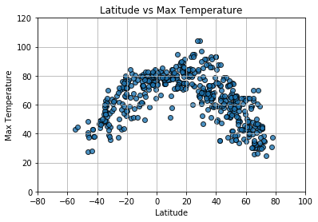

# Equator Weather Analysis
1.  The only effect latitude has on weather is the temperature.  In this analysis, we only looked at the max temperature for each city.  As seen on the graph "Latitude vs Max Temperature", the temperature rises as it draws nearer to the equator.  Further analysis could be done by taking the minimum temperature for the day into consideration.
2.  When looking at the effect of latitude on cloudiness, it seems that there is no real correlation.  The city plots, as shown in the scatterplot, are all over the graph. 
3.  When looking at the effect of latitude on Humidity and Wind Speeds, there is no correlation.  Humidity for most of the cities populate the graph between 80 to 100.  Wind speeds for most of the cities end up between 0 to 15, with a few outliers.  

Analyzing the relationship between longitude against wind speeds, humidity, and cloudiness may yield better results and may draw out better conclusions.  As far as the effect of the latitude to weather, only the max temperature is affected.


```python
#Import Dependencies
from citipy import citipy
import openweathermapy as owm
import requests
import random
import json
import numpy as np
import pandas as pd
from config import api_key
import matplotlib.pyplot as plt
```

# Pseudocodes
1.  import dependencies, modules, etc
2.  generate cities list
    a. generate random latitude and longitude, then put them in a list
    b. get the nearest city based on latitude and longitude using cipy
    c. do an else if statement so that cities do not duplicate
3.  perform the API calls
    a. create a parameter dictionary:  location(lat, lon), gkey
4.  create a dataframe that has: City name, Latitutde, Longitude, Humidity, Cloudiness, Wind Speed, Max Temperature
    a. create csv file
    b. create additional columns that holds allt he information
    c. use iterrows() to generate the random data into the columns
5.  Plot the different scatter plots:
    a. Temperature vs Latitude
    b. Humidity vs Latitude
    c. Cloudiness vs Latitude
    d. Wind Speed vs Latitude
6.  Save the images into a png
7.  Save the dataframe into a CSV file

# Generate Cities


```python
#create random latitude and longitude
lats = np.random.uniform(low=-90.000, high=90.000, size=1500)
lngs = np.random.uniform(low=-180.000, high=180.000, size=1500)
#pair them up into a zip
coordinates = zip(lats, lngs)
```


```python
#Use Citipy to find the nearest city in each pair
cities = []
for coordinate_pair in coordinates:
    lat, lon = coordinate_pair
    cities.append(citipy.nearest_city(lat, lon))
```


```python
#find the city name associated with each pair and put them in a list
city_name = []
for city in cities:
    name = city.city_name
    #code to avoid duplicates in the list
    if name not in city_name:
        city_name.append(name)
```

# Create a DataFrame


```python
#create a dataframe of the cities
cities_df = pd.DataFrame({"City": city_name})

#create empty columns to iterate over later
cities_df["Lat"] = ""
cities_df["Lon"] = ""
cities_df["Humidity"] = ""
cities_df["Cloudiness"] = ""
cities_df["Wind Speed"] = ""
cities_df["Max Temp"] = ""
cities_df["Min Temp"] = ""
cities_df["Country"] = ""
cities_df["Date"] = ""
cities_df.head()
```


<div>
<style scoped>
    .dataframe tbody tr th:only-of-type {
        vertical-align: middle;
    }

    .dataframe tbody tr th {
        vertical-align: top;
    }

    .dataframe thead th {
        text-align: right;
    }
</style>
<table border="1" class="dataframe">
  <thead>
    <tr style="text-align: right;">
      <th></th>
      <th>City</th>
      <th>Lat</th>
      <th>Lon</th>
      <th>Humidity</th>
      <th>Cloudiness</th>
      <th>Wind Speed</th>
      <th>Max Temp</th>
      <th>Min Temp</th>
      <th>Country</th>
      <th>Date</th>
    </tr>
  </thead>
  <tbody>
    <tr>
      <th>0</th>
      <td>rikitea</td>
      <td></td>
      <td></td>
      <td></td>
      <td></td>
      <td></td>
      <td></td>
      <td></td>
      <td></td>
      <td></td>
    </tr>
    <tr>
      <th>1</th>
      <td>ushuaia</td>
      <td></td>
      <td></td>
      <td></td>
      <td></td>
      <td></td>
      <td></td>
      <td></td>
      <td></td>
      <td></td>
    </tr>
    <tr>
      <th>2</th>
      <td>butaritari</td>
      <td></td>
      <td></td>
      <td></td>
      <td></td>
      <td></td>
      <td></td>
      <td></td>
      <td></td>
      <td></td>
    </tr>
    <tr>
      <th>3</th>
      <td>bambanglipuro</td>
      <td></td>
      <td></td>
      <td></td>
      <td></td>
      <td></td>
      <td></td>
      <td></td>
      <td></td>
      <td></td>
    </tr>
    <tr>
      <th>4</th>
      <td>kaitangata</td>
      <td></td>
      <td></td>
      <td></td>
      <td></td>
      <td></td>
      <td></td>
      <td></td>
      <td></td>
      <td></td>
    </tr>
  </tbody>
</table>
</div>


```python
#test to see if there is more than 500 cities in the list
len(cities_df["City"])
```


    574


# Test code for 1 city


```python
#Test run before running the for loop code for the 500+ cities
units = "Imperial"
city = "Tuktoyaktuk"
base_url = "http://api.openweathermap.org/data/2.5/weather?"
query_url = f"{base_url}appid={api_key}&units={units}&q="
response = requests.get(query_url + city).json()
```


```python
#look at the json and see if all the data needed is available
response
```


    {'base': 'stations',
     'clouds': {'all': 75},
     'cod': 200,
     'coord': {'lat': 69.44, 'lon': -133.03},
     'dt': 1527804000,
     'id': 6170031,
     'main': {'humidity': 86,
      'pressure': 1011,
      'temp': 50.85,
      'temp_max': 59,
      'temp_min': 37.4},
     'name': 'Tuktoyaktuk',
     'sys': {'country': 'CA',
      'id': 3555,
      'message': 0.0037,
      'sunrise': 0,
      'sunset': 0,
      'type': 1},
     'visibility': 24140,
     'weather': [{'description': 'broken clouds',
       'icon': '04d',
       'id': 803,
       'main': 'Clouds'}],
     'wind': {'deg': 310, 'speed': 3.36}}


```python
#print out the test results
lat = response["coord"]["lat"]
lon = response["coord"]["lon"]
print(lat, lon)
humidity = response["main"]["humidity"]
cloudiness = response["clouds"]["all"]
wind_speed = response["wind"]["speed"]
max_temp = response["main"]["temp_max"]
min_temp = response["main"]["temp_min"]
print(humidity, cloudiness, wind_speed)
print(min_temp, max_temp)
country = response["sys"]["country"]
date = response["dt"]
print(country, date)
```

    69.44 -133.03
    86 75 3.36
    37.4 59
    CA 1527804000


# Perform the API Calls


```python
#perform the api calls, then store all the data in a database
units = "Imperial"
row_count = 0

#loop through the cities and run a lat/lon search for each city
for index, row in cities_df.iterrows():
    
    #update the parameters with City in each loop
    city = row["City"]
    
    #create the base and the query url
    base_url = "http://api.openweathermap.org/data/2.5/weather?"
    query_url = f"{base_url}appid={api_key}&units={units}&q="
    
    #print and add 1 to the city count
    print(f"Now retrieving weather data for city #{row_count}")
    row_count += 1
    
    #print out the API request for each city
    city_weather = requests.get(query_url + city)
    print(city_weather.url)
    
    #translates the data into json to gather data
    city_weather = city_weather.json()
    
    #find the data
    try:
        city_lat = city_weather["coord"]["lat"]
        city_lon = city_weather["coord"]["lon"]
        city_humidity = city_weather["main"]["humidity"]
        city_cloudiness = city_weather["clouds"]["all"]
        city_windspeed = city_weather["wind"]["speed"]
        city_maxtemp = city_weather["main"]["temp_max"]
        city_mintemp = city_weather["main"]["temp_min"]
        city_country = city_weather["sys"]["country"]
        city_date = city_weather["dt"]
        
        #put the data into the dataframe
        cities_df.loc[index, "Lat"] = city_lat
        cities_df.loc[index, "Lon"] = city_lon
        cities_df.loc[index, "Humidity"] = city_humidity
        cities_df.loc[index, "Cloudiness"] = city_cloudiness
        cities_df.loc[index, "Wind Speed"] = city_windspeed
        cities_df.loc[index, "Max Temp"] = city_maxtemp
        cities_df.loc[index, "Min Temp"] = city_mintemp
        cities_df.loc[index, "Country"] = city_country
        cities_df.loc[index, "Date"] = city_date
        
        #lets the code run if there are missing data and drops the city from the dataframe
    except:
        print("Error with city data.  Dropping row and skipping")
        cities_df.drop(labels=index, inplace=True)
```

    Now retrieving weather data for city #0
    http://api.openweathermap.org/data/2.5/weather?appid=428446174655c4f13b381ad1fa6a6658&units=Imperial&q=rikitea
    Now retrieving weather data for city #1
    http://api.openweathermap.org/data/2.5/weather?appid=428446174655c4f13b381ad1fa6a6658&units=Imperial&q=ushuaia
    Now retrieving weather data for city #2
    http://api.openweathermap.org/data/2.5/weather?appid=428446174655c4f13b381ad1fa6a6658&units=Imperial&q=butaritari
    Now retrieving weather data for city #3
    http://api.openweathermap.org/data/2.5/weather?appid=428446174655c4f13b381ad1fa6a6658&units=Imperial&q=bambanglipuro
    Now retrieving weather data for city #4
    http://api.openweathermap.org/data/2.5/weather?appid=428446174655c4f13b381ad1fa6a6658&units=Imperial&q=kaitangata
    Now retrieving weather data for city #5
    http://api.openweathermap.org/data/2.5/weather?appid=428446174655c4f13b381ad1fa6a6658&units=Imperial&q=saint-philippe
    Now retrieving weather data for city #6
    http://api.openweathermap.org/data/2.5/weather?appid=428446174655c4f13b381ad1fa6a6658&units=Imperial&q=longyearbyen
    Now retrieving weather data for city #7
    http://api.openweathermap.org/data/2.5/weather?appid=428446174655c4f13b381ad1fa6a6658&units=Imperial&q=albany
    Now retrieving weather data for city #8
    http://api.openweathermap.org/data/2.5/weather?appid=428446174655c4f13b381ad1fa6a6658&units=Imperial&q=hovd
    Now retrieving weather data for city #9
    http://api.openweathermap.org/data/2.5/weather?appid=428446174655c4f13b381ad1fa6a6658&units=Imperial&q=shush
    Now retrieving weather data for city #10
    http://api.openweathermap.org/data/2.5/weather?appid=428446174655c4f13b381ad1fa6a6658&units=Imperial&q=kapaa
    Now retrieving weather data for city #11
    http://api.openweathermap.org/data/2.5/weather?appid=428446174655c4f13b381ad1fa6a6658&units=Imperial&q=bluff
    Now retrieving weather data for city #12
    http://api.openweathermap.org/data/2.5/weather?appid=428446174655c4f13b381ad1fa6a6658&units=Imperial&q=torbay
    Now retrieving weather data for city #13
    http://api.openweathermap.org/data/2.5/weather?appid=428446174655c4f13b381ad1fa6a6658&units=Imperial&q=new%20norfolk
    Now retrieving weather data for city #14
    http://api.openweathermap.org/data/2.5/weather?appid=428446174655c4f13b381ad1fa6a6658&units=Imperial&q=vaini
    Now retrieving weather data for city #15
    http://api.openweathermap.org/data/2.5/weather?appid=428446174655c4f13b381ad1fa6a6658&units=Imperial&q=cabo%20san%20lucas
    Now retrieving weather data for city #16
    http://api.openweathermap.org/data/2.5/weather?appid=428446174655c4f13b381ad1fa6a6658&units=Imperial&q=amderma
    Error with city data.  Dropping row and skipping
    Now retrieving weather data for city #17
    http://api.openweathermap.org/data/2.5/weather?appid=428446174655c4f13b381ad1fa6a6658&units=Imperial&q=veshenskaya
    Now retrieving weather data for city #18
    http://api.openweathermap.org/data/2.5/weather?appid=428446174655c4f13b381ad1fa6a6658&units=Imperial&q=qidong
    Now retrieving weather data for city #19
    http://api.openweathermap.org/data/2.5/weather?appid=428446174655c4f13b381ad1fa6a6658&units=Imperial&q=sao%20joao%20da%20barra
    Now retrieving weather data for city #20
    http://api.openweathermap.org/data/2.5/weather?appid=428446174655c4f13b381ad1fa6a6658&units=Imperial&q=tomatlan
    Now retrieving weather data for city #21
    http://api.openweathermap.org/data/2.5/weather?appid=428446174655c4f13b381ad1fa6a6658&units=Imperial&q=mataura
    Now retrieving weather data for city #22
    http://api.openweathermap.org/data/2.5/weather?appid=428446174655c4f13b381ad1fa6a6658&units=Imperial&q=nikolskoye
    Now retrieving weather data for city #23
    http://api.openweathermap.org/data/2.5/weather?appid=428446174655c4f13b381ad1fa6a6658&units=Imperial&q=jamestown
    Now retrieving weather data for city #24
    http://api.openweathermap.org/data/2.5/weather?appid=428446174655c4f13b381ad1fa6a6658&units=Imperial&q=sentyabrskiy
    Error with city data.  Dropping row and skipping
    Now retrieving weather data for city #25
    http://api.openweathermap.org/data/2.5/weather?appid=428446174655c4f13b381ad1fa6a6658&units=Imperial&q=bengkulu
    Error with city data.  Dropping row and skipping
    Now retrieving weather data for city #26
    http://api.openweathermap.org/data/2.5/weather?appid=428446174655c4f13b381ad1fa6a6658&units=Imperial&q=bethel
    Now retrieving weather data for city #27
    http://api.openweathermap.org/data/2.5/weather?appid=428446174655c4f13b381ad1fa6a6658&units=Imperial&q=gurskoye
    Error with city data.  Dropping row and skipping
    Now retrieving weather data for city #28
    http://api.openweathermap.org/data/2.5/weather?appid=428446174655c4f13b381ad1fa6a6658&units=Imperial&q=huamuxtitlan
    Now retrieving weather data for city #29
    http://api.openweathermap.org/data/2.5/weather?appid=428446174655c4f13b381ad1fa6a6658&units=Imperial&q=cape%20town
    Now retrieving weather data for city #30
    http://api.openweathermap.org/data/2.5/weather?appid=428446174655c4f13b381ad1fa6a6658&units=Imperial&q=guangshui
    Now retrieving weather data for city #31
    http://api.openweathermap.org/data/2.5/weather?appid=428446174655c4f13b381ad1fa6a6658&units=Imperial&q=punta%20arenas
    Now retrieving weather data for city #32
    http://api.openweathermap.org/data/2.5/weather?appid=428446174655c4f13b381ad1fa6a6658&units=Imperial&q=puerto%20ayora
    Now retrieving weather data for city #33
    http://api.openweathermap.org/data/2.5/weather?appid=428446174655c4f13b381ad1fa6a6658&units=Imperial&q=homnabad
    Now retrieving weather data for city #34
    http://api.openweathermap.org/data/2.5/weather?appid=428446174655c4f13b381ad1fa6a6658&units=Imperial&q=busselton
    Now retrieving weather data for city #35
    http://api.openweathermap.org/data/2.5/weather?appid=428446174655c4f13b381ad1fa6a6658&units=Imperial&q=mehamn
    Now retrieving weather data for city #36
    http://api.openweathermap.org/data/2.5/weather?appid=428446174655c4f13b381ad1fa6a6658&units=Imperial&q=taolanaro
    Error with city data.  Dropping row and skipping
    Now retrieving weather data for city #37
    http://api.openweathermap.org/data/2.5/weather?appid=428446174655c4f13b381ad1fa6a6658&units=Imperial&q=valparaiso
    Now retrieving weather data for city #38
    http://api.openweathermap.org/data/2.5/weather?appid=428446174655c4f13b381ad1fa6a6658&units=Imperial&q=attawapiskat
    Error with city data.  Dropping row and skipping
    Now retrieving weather data for city #39
    http://api.openweathermap.org/data/2.5/weather?appid=428446174655c4f13b381ad1fa6a6658&units=Imperial&q=nizhnyaya%20tura
    Now retrieving weather data for city #40
    http://api.openweathermap.org/data/2.5/weather?appid=428446174655c4f13b381ad1fa6a6658&units=Imperial&q=rovaniemi
    Now retrieving weather data for city #41
    http://api.openweathermap.org/data/2.5/weather?appid=428446174655c4f13b381ad1fa6a6658&units=Imperial&q=halalo
    Error with city data.  Dropping row and skipping
    Now retrieving weather data for city #42
    http://api.openweathermap.org/data/2.5/weather?appid=428446174655c4f13b381ad1fa6a6658&units=Imperial&q=kununurra
    Now retrieving weather data for city #43
    http://api.openweathermap.org/data/2.5/weather?appid=428446174655c4f13b381ad1fa6a6658&units=Imperial&q=erenhot
    Now retrieving weather data for city #44
    http://api.openweathermap.org/data/2.5/weather?appid=428446174655c4f13b381ad1fa6a6658&units=Imperial&q=vredendal
    Now retrieving weather data for city #45
    http://api.openweathermap.org/data/2.5/weather?appid=428446174655c4f13b381ad1fa6a6658&units=Imperial&q=road%20town
    Now retrieving weather data for city #46
    http://api.openweathermap.org/data/2.5/weather?appid=428446174655c4f13b381ad1fa6a6658&units=Imperial&q=beloha
    Now retrieving weather data for city #47
    http://api.openweathermap.org/data/2.5/weather?appid=428446174655c4f13b381ad1fa6a6658&units=Imperial&q=illoqqortoormiut
    Error with city data.  Dropping row and skipping
    Now retrieving weather data for city #48
    http://api.openweathermap.org/data/2.5/weather?appid=428446174655c4f13b381ad1fa6a6658&units=Imperial&q=taltal
    Now retrieving weather data for city #49
    http://api.openweathermap.org/data/2.5/weather?appid=428446174655c4f13b381ad1fa6a6658&units=Imperial&q=vigeland
    Now retrieving weather data for city #50
    http://api.openweathermap.org/data/2.5/weather?appid=428446174655c4f13b381ad1fa6a6658&units=Imperial&q=yellowknife
    Now retrieving weather data for city #51
    http://api.openweathermap.org/data/2.5/weather?appid=428446174655c4f13b381ad1fa6a6658&units=Imperial&q=sitka
    Now retrieving weather data for city #52
    http://api.openweathermap.org/data/2.5/weather?appid=428446174655c4f13b381ad1fa6a6658&units=Imperial&q=derzhavinsk
    Now retrieving weather data for city #53
    http://api.openweathermap.org/data/2.5/weather?appid=428446174655c4f13b381ad1fa6a6658&units=Imperial&q=bambous%20virieux
    Now retrieving weather data for city #54
    http://api.openweathermap.org/data/2.5/weather?appid=428446174655c4f13b381ad1fa6a6658&units=Imperial&q=severo-kurilsk
    Now retrieving weather data for city #55
    http://api.openweathermap.org/data/2.5/weather?appid=428446174655c4f13b381ad1fa6a6658&units=Imperial&q=lambarene
    Now retrieving weather data for city #56
    http://api.openweathermap.org/data/2.5/weather?appid=428446174655c4f13b381ad1fa6a6658&units=Imperial&q=tumannyy
    Error with city data.  Dropping row and skipping
    Now retrieving weather data for city #57
    http://api.openweathermap.org/data/2.5/weather?appid=428446174655c4f13b381ad1fa6a6658&units=Imperial&q=alice%20springs
    Now retrieving weather data for city #58
    http://api.openweathermap.org/data/2.5/weather?appid=428446174655c4f13b381ad1fa6a6658&units=Imperial&q=yerbogachen
    Now retrieving weather data for city #59
    http://api.openweathermap.org/data/2.5/weather?appid=428446174655c4f13b381ad1fa6a6658&units=Imperial&q=badiraguato
    Now retrieving weather data for city #60
    http://api.openweathermap.org/data/2.5/weather?appid=428446174655c4f13b381ad1fa6a6658&units=Imperial&q=hithadhoo
    Now retrieving weather data for city #61
    http://api.openweathermap.org/data/2.5/weather?appid=428446174655c4f13b381ad1fa6a6658&units=Imperial&q=saskylakh
    Now retrieving weather data for city #62
    http://api.openweathermap.org/data/2.5/weather?appid=428446174655c4f13b381ad1fa6a6658&units=Imperial&q=punta%20umbria
    Now retrieving weather data for city #63
    http://api.openweathermap.org/data/2.5/weather?appid=428446174655c4f13b381ad1fa6a6658&units=Imperial&q=sao%20filipe
    Now retrieving weather data for city #64
    http://api.openweathermap.org/data/2.5/weather?appid=428446174655c4f13b381ad1fa6a6658&units=Imperial&q=esmeraldas
    Now retrieving weather data for city #65
    http://api.openweathermap.org/data/2.5/weather?appid=428446174655c4f13b381ad1fa6a6658&units=Imperial&q=tuktoyaktuk
    Now retrieving weather data for city #66
    http://api.openweathermap.org/data/2.5/weather?appid=428446174655c4f13b381ad1fa6a6658&units=Imperial&q=tateyama
    Now retrieving weather data for city #67
    http://api.openweathermap.org/data/2.5/weather?appid=428446174655c4f13b381ad1fa6a6658&units=Imperial&q=port%20elizabeth
    Now retrieving weather data for city #68
    http://api.openweathermap.org/data/2.5/weather?appid=428446174655c4f13b381ad1fa6a6658&units=Imperial&q=pevek
    Now retrieving weather data for city #69
    http://api.openweathermap.org/data/2.5/weather?appid=428446174655c4f13b381ad1fa6a6658&units=Imperial&q=saint%20george
    Now retrieving weather data for city #70
    http://api.openweathermap.org/data/2.5/weather?appid=428446174655c4f13b381ad1fa6a6658&units=Imperial&q=los%20llanos%20de%20aridane
    Now retrieving weather data for city #71
    http://api.openweathermap.org/data/2.5/weather?appid=428446174655c4f13b381ad1fa6a6658&units=Imperial&q=maricao
    Now retrieving weather data for city #72
    http://api.openweathermap.org/data/2.5/weather?appid=428446174655c4f13b381ad1fa6a6658&units=Imperial&q=hobart
    Now retrieving weather data for city #73
    http://api.openweathermap.org/data/2.5/weather?appid=428446174655c4f13b381ad1fa6a6658&units=Imperial&q=carnarvon
    Now retrieving weather data for city #74
    http://api.openweathermap.org/data/2.5/weather?appid=428446174655c4f13b381ad1fa6a6658&units=Imperial&q=skjervoy
    Now retrieving weather data for city #75
    http://api.openweathermap.org/data/2.5/weather?appid=428446174655c4f13b381ad1fa6a6658&units=Imperial&q=east%20london
    Now retrieving weather data for city #76
    http://api.openweathermap.org/data/2.5/weather?appid=428446174655c4f13b381ad1fa6a6658&units=Imperial&q=chuy
    Now retrieving weather data for city #77
    http://api.openweathermap.org/data/2.5/weather?appid=428446174655c4f13b381ad1fa6a6658&units=Imperial&q=albina
    Now retrieving weather data for city #78
    http://api.openweathermap.org/data/2.5/weather?appid=428446174655c4f13b381ad1fa6a6658&units=Imperial&q=tatawin
    Error with city data.  Dropping row and skipping
    Now retrieving weather data for city #79
    http://api.openweathermap.org/data/2.5/weather?appid=428446174655c4f13b381ad1fa6a6658&units=Imperial&q=saltpond
    Now retrieving weather data for city #80
    http://api.openweathermap.org/data/2.5/weather?appid=428446174655c4f13b381ad1fa6a6658&units=Imperial&q=tasiilaq
    Now retrieving weather data for city #81
    http://api.openweathermap.org/data/2.5/weather?appid=428446174655c4f13b381ad1fa6a6658&units=Imperial&q=kudahuvadhoo
    Now retrieving weather data for city #82
    http://api.openweathermap.org/data/2.5/weather?appid=428446174655c4f13b381ad1fa6a6658&units=Imperial&q=ishigaki
    Now retrieving weather data for city #83
    http://api.openweathermap.org/data/2.5/weather?appid=428446174655c4f13b381ad1fa6a6658&units=Imperial&q=georgetown
    Now retrieving weather data for city #84
    http://api.openweathermap.org/data/2.5/weather?appid=428446174655c4f13b381ad1fa6a6658&units=Imperial&q=cidreira
    Now retrieving weather data for city #85
    http://api.openweathermap.org/data/2.5/weather?appid=428446174655c4f13b381ad1fa6a6658&units=Imperial&q=kavaratti
    Now retrieving weather data for city #86
    http://api.openweathermap.org/data/2.5/weather?appid=428446174655c4f13b381ad1fa6a6658&units=Imperial&q=nizip
    Now retrieving weather data for city #87
    http://api.openweathermap.org/data/2.5/weather?appid=428446174655c4f13b381ad1fa6a6658&units=Imperial&q=port%20alfred
    Now retrieving weather data for city #88
    http://api.openweathermap.org/data/2.5/weather?appid=428446174655c4f13b381ad1fa6a6658&units=Imperial&q=kanashevo
    Now retrieving weather data for city #89
    http://api.openweathermap.org/data/2.5/weather?appid=428446174655c4f13b381ad1fa6a6658&units=Imperial&q=barentsburg
    Error with city data.  Dropping row and skipping
    Now retrieving weather data for city #90
    http://api.openweathermap.org/data/2.5/weather?appid=428446174655c4f13b381ad1fa6a6658&units=Imperial&q=atuona
    Now retrieving weather data for city #91
    http://api.openweathermap.org/data/2.5/weather?appid=428446174655c4f13b381ad1fa6a6658&units=Imperial&q=hilo
    Now retrieving weather data for city #92
    http://api.openweathermap.org/data/2.5/weather?appid=428446174655c4f13b381ad1fa6a6658&units=Imperial&q=constitucion
    Now retrieving weather data for city #93
    http://api.openweathermap.org/data/2.5/weather?appid=428446174655c4f13b381ad1fa6a6658&units=Imperial&q=ratangarh
    Now retrieving weather data for city #94
    http://api.openweathermap.org/data/2.5/weather?appid=428446174655c4f13b381ad1fa6a6658&units=Imperial&q=trairi
    Now retrieving weather data for city #95
    http://api.openweathermap.org/data/2.5/weather?appid=428446174655c4f13b381ad1fa6a6658&units=Imperial&q=cayenne
    Now retrieving weather data for city #96
    http://api.openweathermap.org/data/2.5/weather?appid=428446174655c4f13b381ad1fa6a6658&units=Imperial&q=la%20uribe
    Error with city data.  Dropping row and skipping
    Now retrieving weather data for city #97
    http://api.openweathermap.org/data/2.5/weather?appid=428446174655c4f13b381ad1fa6a6658&units=Imperial&q=bolungarvik
    Error with city data.  Dropping row and skipping
    Now retrieving weather data for city #98
    http://api.openweathermap.org/data/2.5/weather?appid=428446174655c4f13b381ad1fa6a6658&units=Imperial&q=qaanaaq
    Now retrieving weather data for city #99
    http://api.openweathermap.org/data/2.5/weather?appid=428446174655c4f13b381ad1fa6a6658&units=Imperial&q=nemuro
    Now retrieving weather data for city #100
    http://api.openweathermap.org/data/2.5/weather?appid=428446174655c4f13b381ad1fa6a6658&units=Imperial&q=villa%20constitucion
    Now retrieving weather data for city #101
    http://api.openweathermap.org/data/2.5/weather?appid=428446174655c4f13b381ad1fa6a6658&units=Imperial&q=louisbourg
    Error with city data.  Dropping row and skipping
    Now retrieving weather data for city #102
    http://api.openweathermap.org/data/2.5/weather?appid=428446174655c4f13b381ad1fa6a6658&units=Imperial&q=pisco
    Now retrieving weather data for city #103
    http://api.openweathermap.org/data/2.5/weather?appid=428446174655c4f13b381ad1fa6a6658&units=Imperial&q=raga
    Error with city data.  Dropping row and skipping
    Now retrieving weather data for city #104
    http://api.openweathermap.org/data/2.5/weather?appid=428446174655c4f13b381ad1fa6a6658&units=Imperial&q=eureka
    Now retrieving weather data for city #105
    http://api.openweathermap.org/data/2.5/weather?appid=428446174655c4f13b381ad1fa6a6658&units=Imperial&q=samarai
    Now retrieving weather data for city #106
    http://api.openweathermap.org/data/2.5/weather?appid=428446174655c4f13b381ad1fa6a6658&units=Imperial&q=ayan
    Now retrieving weather data for city #107
    http://api.openweathermap.org/data/2.5/weather?appid=428446174655c4f13b381ad1fa6a6658&units=Imperial&q=serafimovich
    Now retrieving weather data for city #108
    http://api.openweathermap.org/data/2.5/weather?appid=428446174655c4f13b381ad1fa6a6658&units=Imperial&q=teofilo%20otoni
    Now retrieving weather data for city #109
    http://api.openweathermap.org/data/2.5/weather?appid=428446174655c4f13b381ad1fa6a6658&units=Imperial&q=aklavik
    Now retrieving weather data for city #110
    http://api.openweathermap.org/data/2.5/weather?appid=428446174655c4f13b381ad1fa6a6658&units=Imperial&q=comodoro%20rivadavia
    Now retrieving weather data for city #111
    http://api.openweathermap.org/data/2.5/weather?appid=428446174655c4f13b381ad1fa6a6658&units=Imperial&q=vaitupu
    Error with city data.  Dropping row and skipping
    Now retrieving weather data for city #112
    http://api.openweathermap.org/data/2.5/weather?appid=428446174655c4f13b381ad1fa6a6658&units=Imperial&q=telixtlahuaca
    Error with city data.  Dropping row and skipping
    Now retrieving weather data for city #113
    http://api.openweathermap.org/data/2.5/weather?appid=428446174655c4f13b381ad1fa6a6658&units=Imperial&q=nenjiang
    Now retrieving weather data for city #114
    http://api.openweathermap.org/data/2.5/weather?appid=428446174655c4f13b381ad1fa6a6658&units=Imperial&q=imeni%20poliny%20osipenko
    Now retrieving weather data for city #115
    http://api.openweathermap.org/data/2.5/weather?appid=428446174655c4f13b381ad1fa6a6658&units=Imperial&q=surt
    Now retrieving weather data for city #116
    http://api.openweathermap.org/data/2.5/weather?appid=428446174655c4f13b381ad1fa6a6658&units=Imperial&q=berbera
    Error with city data.  Dropping row and skipping
    Now retrieving weather data for city #117
    http://api.openweathermap.org/data/2.5/weather?appid=428446174655c4f13b381ad1fa6a6658&units=Imperial&q=alenquer
    Now retrieving weather data for city #118
    http://api.openweathermap.org/data/2.5/weather?appid=428446174655c4f13b381ad1fa6a6658&units=Imperial&q=sola
    Now retrieving weather data for city #119
    http://api.openweathermap.org/data/2.5/weather?appid=428446174655c4f13b381ad1fa6a6658&units=Imperial&q=omboue
    Now retrieving weather data for city #120
    http://api.openweathermap.org/data/2.5/weather?appid=428446174655c4f13b381ad1fa6a6658&units=Imperial&q=mahebourg
    Now retrieving weather data for city #121
    http://api.openweathermap.org/data/2.5/weather?appid=428446174655c4f13b381ad1fa6a6658&units=Imperial&q=basco
    Now retrieving weather data for city #122
    http://api.openweathermap.org/data/2.5/weather?appid=428446174655c4f13b381ad1fa6a6658&units=Imperial&q=turtkul
    Error with city data.  Dropping row and skipping
    Now retrieving weather data for city #123
    http://api.openweathermap.org/data/2.5/weather?appid=428446174655c4f13b381ad1fa6a6658&units=Imperial&q=petropavlovsk-kamchatskiy
    Now retrieving weather data for city #124
    http://api.openweathermap.org/data/2.5/weather?appid=428446174655c4f13b381ad1fa6a6658&units=Imperial&q=ahumada
    Error with city data.  Dropping row and skipping
    Now retrieving weather data for city #125
    http://api.openweathermap.org/data/2.5/weather?appid=428446174655c4f13b381ad1fa6a6658&units=Imperial&q=kiama
    Now retrieving weather data for city #126
    http://api.openweathermap.org/data/2.5/weather?appid=428446174655c4f13b381ad1fa6a6658&units=Imperial&q=bredasdorp
    Now retrieving weather data for city #127
    http://api.openweathermap.org/data/2.5/weather?appid=428446174655c4f13b381ad1fa6a6658&units=Imperial&q=enid
    Now retrieving weather data for city #128
    http://api.openweathermap.org/data/2.5/weather?appid=428446174655c4f13b381ad1fa6a6658&units=Imperial&q=annau
    Now retrieving weather data for city #129
    http://api.openweathermap.org/data/2.5/weather?appid=428446174655c4f13b381ad1fa6a6658&units=Imperial&q=arrecife
    Error with city data.  Dropping row and skipping
    Now retrieving weather data for city #130
    http://api.openweathermap.org/data/2.5/weather?appid=428446174655c4f13b381ad1fa6a6658&units=Imperial&q=mar%20del%20plata
    Now retrieving weather data for city #131
    http://api.openweathermap.org/data/2.5/weather?appid=428446174655c4f13b381ad1fa6a6658&units=Imperial&q=kholtoson
    Now retrieving weather data for city #132
    http://api.openweathermap.org/data/2.5/weather?appid=428446174655c4f13b381ad1fa6a6658&units=Imperial&q=hasaki
    Now retrieving weather data for city #133
    http://api.openweathermap.org/data/2.5/weather?appid=428446174655c4f13b381ad1fa6a6658&units=Imperial&q=zhangzhou
    Now retrieving weather data for city #134
    http://api.openweathermap.org/data/2.5/weather?appid=428446174655c4f13b381ad1fa6a6658&units=Imperial&q=faanui
    Now retrieving weather data for city #135
    http://api.openweathermap.org/data/2.5/weather?appid=428446174655c4f13b381ad1fa6a6658&units=Imperial&q=guozhen
    Now retrieving weather data for city #136
    http://api.openweathermap.org/data/2.5/weather?appid=428446174655c4f13b381ad1fa6a6658&units=Imperial&q=kahului
    Now retrieving weather data for city #137
    http://api.openweathermap.org/data/2.5/weather?appid=428446174655c4f13b381ad1fa6a6658&units=Imperial&q=catamarca
    Error with city data.  Dropping row and skipping
    Now retrieving weather data for city #138
    http://api.openweathermap.org/data/2.5/weather?appid=428446174655c4f13b381ad1fa6a6658&units=Imperial&q=aflu
    Error with city data.  Dropping row and skipping
    Now retrieving weather data for city #139
    http://api.openweathermap.org/data/2.5/weather?appid=428446174655c4f13b381ad1fa6a6658&units=Imperial&q=sidi%20bu%20zayd
    Error with city data.  Dropping row and skipping
    Now retrieving weather data for city #140
    http://api.openweathermap.org/data/2.5/weather?appid=428446174655c4f13b381ad1fa6a6658&units=Imperial&q=klaksvik
    Now retrieving weather data for city #141
    http://api.openweathermap.org/data/2.5/weather?appid=428446174655c4f13b381ad1fa6a6658&units=Imperial&q=paamiut
    Now retrieving weather data for city #142
    http://api.openweathermap.org/data/2.5/weather?appid=428446174655c4f13b381ad1fa6a6658&units=Imperial&q=jalu
    Now retrieving weather data for city #143
    http://api.openweathermap.org/data/2.5/weather?appid=428446174655c4f13b381ad1fa6a6658&units=Imperial&q=traralgon
    Now retrieving weather data for city #144
    http://api.openweathermap.org/data/2.5/weather?appid=428446174655c4f13b381ad1fa6a6658&units=Imperial&q=grand%20river%20south%20east
    Error with city data.  Dropping row and skipping
    Now retrieving weather data for city #145
    http://api.openweathermap.org/data/2.5/weather?appid=428446174655c4f13b381ad1fa6a6658&units=Imperial&q=bridlington
    Now retrieving weather data for city #146
    http://api.openweathermap.org/data/2.5/weather?appid=428446174655c4f13b381ad1fa6a6658&units=Imperial&q=kiruna
    Now retrieving weather data for city #147
    http://api.openweathermap.org/data/2.5/weather?appid=428446174655c4f13b381ad1fa6a6658&units=Imperial&q=kalanguy
    Now retrieving weather data for city #148
    http://api.openweathermap.org/data/2.5/weather?appid=428446174655c4f13b381ad1fa6a6658&units=Imperial&q=arraial%20do%20cabo
    Now retrieving weather data for city #149
    http://api.openweathermap.org/data/2.5/weather?appid=428446174655c4f13b381ad1fa6a6658&units=Imperial&q=marsa%20matruh
    Now retrieving weather data for city #150
    http://api.openweathermap.org/data/2.5/weather?appid=428446174655c4f13b381ad1fa6a6658&units=Imperial&q=puerto%20del%20rosario
    Now retrieving weather data for city #151
    http://api.openweathermap.org/data/2.5/weather?appid=428446174655c4f13b381ad1fa6a6658&units=Imperial&q=mys%20shmidta
    Error with city data.  Dropping row and skipping
    Now retrieving weather data for city #152
    http://api.openweathermap.org/data/2.5/weather?appid=428446174655c4f13b381ad1fa6a6658&units=Imperial&q=lima
    Now retrieving weather data for city #153
    http://api.openweathermap.org/data/2.5/weather?appid=428446174655c4f13b381ad1fa6a6658&units=Imperial&q=upernavik
    Now retrieving weather data for city #154
    http://api.openweathermap.org/data/2.5/weather?appid=428446174655c4f13b381ad1fa6a6658&units=Imperial&q=olafsvik
    Error with city data.  Dropping row and skipping
    Now retrieving weather data for city #155
    http://api.openweathermap.org/data/2.5/weather?appid=428446174655c4f13b381ad1fa6a6658&units=Imperial&q=coquimbo
    Now retrieving weather data for city #156
    http://api.openweathermap.org/data/2.5/weather?appid=428446174655c4f13b381ad1fa6a6658&units=Imperial&q=mabaruma
    Now retrieving weather data for city #157
    http://api.openweathermap.org/data/2.5/weather?appid=428446174655c4f13b381ad1fa6a6658&units=Imperial&q=lebu
    Now retrieving weather data for city #158
    http://api.openweathermap.org/data/2.5/weather?appid=428446174655c4f13b381ad1fa6a6658&units=Imperial&q=fort%20saint%20john
    Error with city data.  Dropping row and skipping
    Now retrieving weather data for city #159
    http://api.openweathermap.org/data/2.5/weather?appid=428446174655c4f13b381ad1fa6a6658&units=Imperial&q=clyde%20river
    Now retrieving weather data for city #160
    http://api.openweathermap.org/data/2.5/weather?appid=428446174655c4f13b381ad1fa6a6658&units=Imperial&q=irtyshskiy
    Now retrieving weather data for city #161
    http://api.openweathermap.org/data/2.5/weather?appid=428446174655c4f13b381ad1fa6a6658&units=Imperial&q=half%20moon%20bay
    Now retrieving weather data for city #162
    http://api.openweathermap.org/data/2.5/weather?appid=428446174655c4f13b381ad1fa6a6658&units=Imperial&q=karauzyak
    Error with city data.  Dropping row and skipping
    Now retrieving weather data for city #163
    http://api.openweathermap.org/data/2.5/weather?appid=428446174655c4f13b381ad1fa6a6658&units=Imperial&q=domoni
    Error with city data.  Dropping row and skipping
    Now retrieving weather data for city #164
    http://api.openweathermap.org/data/2.5/weather?appid=428446174655c4f13b381ad1fa6a6658&units=Imperial&q=lasa
    Now retrieving weather data for city #165
    http://api.openweathermap.org/data/2.5/weather?appid=428446174655c4f13b381ad1fa6a6658&units=Imperial&q=nishihara
    Now retrieving weather data for city #166
    http://api.openweathermap.org/data/2.5/weather?appid=428446174655c4f13b381ad1fa6a6658&units=Imperial&q=ulladulla
    Now retrieving weather data for city #167
    http://api.openweathermap.org/data/2.5/weather?appid=428446174655c4f13b381ad1fa6a6658&units=Imperial&q=thompson
    Now retrieving weather data for city #168
    http://api.openweathermap.org/data/2.5/weather?appid=428446174655c4f13b381ad1fa6a6658&units=Imperial&q=hobyo
    Now retrieving weather data for city #169
    http://api.openweathermap.org/data/2.5/weather?appid=428446174655c4f13b381ad1fa6a6658&units=Imperial&q=goderich
    Now retrieving weather data for city #170
    http://api.openweathermap.org/data/2.5/weather?appid=428446174655c4f13b381ad1fa6a6658&units=Imperial&q=tautira
    Now retrieving weather data for city #171
    http://api.openweathermap.org/data/2.5/weather?appid=428446174655c4f13b381ad1fa6a6658&units=Imperial&q=hermanus
    Now retrieving weather data for city #172
    http://api.openweathermap.org/data/2.5/weather?appid=428446174655c4f13b381ad1fa6a6658&units=Imperial&q=khorixas
    Now retrieving weather data for city #173
    http://api.openweathermap.org/data/2.5/weather?appid=428446174655c4f13b381ad1fa6a6658&units=Imperial&q=tawkar
    Error with city data.  Dropping row and skipping
    Now retrieving weather data for city #174
    http://api.openweathermap.org/data/2.5/weather?appid=428446174655c4f13b381ad1fa6a6658&units=Imperial&q=pedernales
    Now retrieving weather data for city #175
    http://api.openweathermap.org/data/2.5/weather?appid=428446174655c4f13b381ad1fa6a6658&units=Imperial&q=tanem
    Now retrieving weather data for city #176
    http://api.openweathermap.org/data/2.5/weather?appid=428446174655c4f13b381ad1fa6a6658&units=Imperial&q=bandundu
    Now retrieving weather data for city #177
    http://api.openweathermap.org/data/2.5/weather?appid=428446174655c4f13b381ad1fa6a6658&units=Imperial&q=norman%20wells
    Now retrieving weather data for city #178
    http://api.openweathermap.org/data/2.5/weather?appid=428446174655c4f13b381ad1fa6a6658&units=Imperial&q=arman
    Now retrieving weather data for city #179
    http://api.openweathermap.org/data/2.5/weather?appid=428446174655c4f13b381ad1fa6a6658&units=Imperial&q=cherskiy
    Now retrieving weather data for city #180
    http://api.openweathermap.org/data/2.5/weather?appid=428446174655c4f13b381ad1fa6a6658&units=Imperial&q=castro
    Now retrieving weather data for city #181
    http://api.openweathermap.org/data/2.5/weather?appid=428446174655c4f13b381ad1fa6a6658&units=Imperial&q=acireale
    Now retrieving weather data for city #182
    http://api.openweathermap.org/data/2.5/weather?appid=428446174655c4f13b381ad1fa6a6658&units=Imperial&q=kodiak
    Now retrieving weather data for city #183
    http://api.openweathermap.org/data/2.5/weather?appid=428446174655c4f13b381ad1fa6a6658&units=Imperial&q=benjamin%20aceval
    Now retrieving weather data for city #184
    http://api.openweathermap.org/data/2.5/weather?appid=428446174655c4f13b381ad1fa6a6658&units=Imperial&q=yeppoon
    Now retrieving weather data for city #185
    http://api.openweathermap.org/data/2.5/weather?appid=428446174655c4f13b381ad1fa6a6658&units=Imperial&q=roccastrada
    Now retrieving weather data for city #186
    http://api.openweathermap.org/data/2.5/weather?appid=428446174655c4f13b381ad1fa6a6658&units=Imperial&q=clonakilty
    Now retrieving weather data for city #187
    http://api.openweathermap.org/data/2.5/weather?appid=428446174655c4f13b381ad1fa6a6658&units=Imperial&q=airai
    Now retrieving weather data for city #188
    http://api.openweathermap.org/data/2.5/weather?appid=428446174655c4f13b381ad1fa6a6658&units=Imperial&q=nguiu
    Error with city data.  Dropping row and skipping
    Now retrieving weather data for city #189
    http://api.openweathermap.org/data/2.5/weather?appid=428446174655c4f13b381ad1fa6a6658&units=Imperial&q=kungurtug
    Now retrieving weather data for city #190
    http://api.openweathermap.org/data/2.5/weather?appid=428446174655c4f13b381ad1fa6a6658&units=Imperial&q=padang
    Now retrieving weather data for city #191
    http://api.openweathermap.org/data/2.5/weather?appid=428446174655c4f13b381ad1fa6a6658&units=Imperial&q=avarua
    Now retrieving weather data for city #192
    http://api.openweathermap.org/data/2.5/weather?appid=428446174655c4f13b381ad1fa6a6658&units=Imperial&q=putina
    Now retrieving weather data for city #193
    http://api.openweathermap.org/data/2.5/weather?appid=428446174655c4f13b381ad1fa6a6658&units=Imperial&q=ancud
    Now retrieving weather data for city #194
    http://api.openweathermap.org/data/2.5/weather?appid=428446174655c4f13b381ad1fa6a6658&units=Imperial&q=maldonado
    Now retrieving weather data for city #195
    http://api.openweathermap.org/data/2.5/weather?appid=428446174655c4f13b381ad1fa6a6658&units=Imperial&q=raton
    Now retrieving weather data for city #196
    http://api.openweathermap.org/data/2.5/weather?appid=428446174655c4f13b381ad1fa6a6658&units=Imperial&q=satipo
    Now retrieving weather data for city #197
    http://api.openweathermap.org/data/2.5/weather?appid=428446174655c4f13b381ad1fa6a6658&units=Imperial&q=anar%20darreh
    Error with city data.  Dropping row and skipping
    Now retrieving weather data for city #198
    http://api.openweathermap.org/data/2.5/weather?appid=428446174655c4f13b381ad1fa6a6658&units=Imperial&q=atar
    Now retrieving weather data for city #199
    http://api.openweathermap.org/data/2.5/weather?appid=428446174655c4f13b381ad1fa6a6658&units=Imperial&q=flin%20flon
    Now retrieving weather data for city #200
    http://api.openweathermap.org/data/2.5/weather?appid=428446174655c4f13b381ad1fa6a6658&units=Imperial&q=la%20ronge
    Now retrieving weather data for city #201
    http://api.openweathermap.org/data/2.5/weather?appid=428446174655c4f13b381ad1fa6a6658&units=Imperial&q=barrow
    Now retrieving weather data for city #202
    http://api.openweathermap.org/data/2.5/weather?appid=428446174655c4f13b381ad1fa6a6658&units=Imperial&q=olinda
    Now retrieving weather data for city #203
    http://api.openweathermap.org/data/2.5/weather?appid=428446174655c4f13b381ad1fa6a6658&units=Imperial&q=umzimvubu
    Error with city data.  Dropping row and skipping
    Now retrieving weather data for city #204
    http://api.openweathermap.org/data/2.5/weather?appid=428446174655c4f13b381ad1fa6a6658&units=Imperial&q=varhaug
    Now retrieving weather data for city #205
    http://api.openweathermap.org/data/2.5/weather?appid=428446174655c4f13b381ad1fa6a6658&units=Imperial&q=tazovskiy
    Now retrieving weather data for city #206
    http://api.openweathermap.org/data/2.5/weather?appid=428446174655c4f13b381ad1fa6a6658&units=Imperial&q=mae%20hong%20son
    Now retrieving weather data for city #207
    http://api.openweathermap.org/data/2.5/weather?appid=428446174655c4f13b381ad1fa6a6658&units=Imperial&q=lanxi
    Now retrieving weather data for city #208
    http://api.openweathermap.org/data/2.5/weather?appid=428446174655c4f13b381ad1fa6a6658&units=Imperial&q=nanortalik
    Now retrieving weather data for city #209
    http://api.openweathermap.org/data/2.5/weather?appid=428446174655c4f13b381ad1fa6a6658&units=Imperial&q=port%20augusta
    Now retrieving weather data for city #210
    http://api.openweathermap.org/data/2.5/weather?appid=428446174655c4f13b381ad1fa6a6658&units=Imperial&q=coari
    Now retrieving weather data for city #211
    http://api.openweathermap.org/data/2.5/weather?appid=428446174655c4f13b381ad1fa6a6658&units=Imperial&q=vila%20do%20maio
    Now retrieving weather data for city #212
    http://api.openweathermap.org/data/2.5/weather?appid=428446174655c4f13b381ad1fa6a6658&units=Imperial&q=kawalu
    Now retrieving weather data for city #213
    http://api.openweathermap.org/data/2.5/weather?appid=428446174655c4f13b381ad1fa6a6658&units=Imperial&q=ribeira%20grande
    Now retrieving weather data for city #214
    http://api.openweathermap.org/data/2.5/weather?appid=428446174655c4f13b381ad1fa6a6658&units=Imperial&q=mentok
    Error with city data.  Dropping row and skipping
    Now retrieving weather data for city #215
    http://api.openweathermap.org/data/2.5/weather?appid=428446174655c4f13b381ad1fa6a6658&units=Imperial&q=fairbanks
    Now retrieving weather data for city #216
    http://api.openweathermap.org/data/2.5/weather?appid=428446174655c4f13b381ad1fa6a6658&units=Imperial&q=malanje
    Now retrieving weather data for city #217
    http://api.openweathermap.org/data/2.5/weather?appid=428446174655c4f13b381ad1fa6a6658&units=Imperial&q=venado%20tuerto
    Now retrieving weather data for city #218
    http://api.openweathermap.org/data/2.5/weather?appid=428446174655c4f13b381ad1fa6a6658&units=Imperial&q=buenos%20aires
    Now retrieving weather data for city #219
    http://api.openweathermap.org/data/2.5/weather?appid=428446174655c4f13b381ad1fa6a6658&units=Imperial&q=petropavl
    Now retrieving weather data for city #220
    http://api.openweathermap.org/data/2.5/weather?appid=428446174655c4f13b381ad1fa6a6658&units=Imperial&q=victoria
    Now retrieving weather data for city #221
    http://api.openweathermap.org/data/2.5/weather?appid=428446174655c4f13b381ad1fa6a6658&units=Imperial&q=belushya%20guba
    Error with city data.  Dropping row and skipping
    Now retrieving weather data for city #222
    http://api.openweathermap.org/data/2.5/weather?appid=428446174655c4f13b381ad1fa6a6658&units=Imperial&q=khormuj
    Error with city data.  Dropping row and skipping
    Now retrieving weather data for city #223
    http://api.openweathermap.org/data/2.5/weather?appid=428446174655c4f13b381ad1fa6a6658&units=Imperial&q=burica
    Error with city data.  Dropping row and skipping
    Now retrieving weather data for city #224
    http://api.openweathermap.org/data/2.5/weather?appid=428446174655c4f13b381ad1fa6a6658&units=Imperial&q=grand%20gaube
    Now retrieving weather data for city #225
    http://api.openweathermap.org/data/2.5/weather?appid=428446174655c4f13b381ad1fa6a6658&units=Imperial&q=xingyi
    Now retrieving weather data for city #226
    http://api.openweathermap.org/data/2.5/weather?appid=428446174655c4f13b381ad1fa6a6658&units=Imperial&q=mountain%20home
    Now retrieving weather data for city #227
    http://api.openweathermap.org/data/2.5/weather?appid=428446174655c4f13b381ad1fa6a6658&units=Imperial&q=wagar
    Now retrieving weather data for city #228
    http://api.openweathermap.org/data/2.5/weather?appid=428446174655c4f13b381ad1fa6a6658&units=Imperial&q=broome
    Now retrieving weather data for city #229
    http://api.openweathermap.org/data/2.5/weather?appid=428446174655c4f13b381ad1fa6a6658&units=Imperial&q=villa%20carlos%20paz
    Now retrieving weather data for city #230
    http://api.openweathermap.org/data/2.5/weather?appid=428446174655c4f13b381ad1fa6a6658&units=Imperial&q=xining
    Now retrieving weather data for city #231
    http://api.openweathermap.org/data/2.5/weather?appid=428446174655c4f13b381ad1fa6a6658&units=Imperial&q=maceio
    Now retrieving weather data for city #232
    http://api.openweathermap.org/data/2.5/weather?appid=428446174655c4f13b381ad1fa6a6658&units=Imperial&q=turukhansk
    Now retrieving weather data for city #233
    http://api.openweathermap.org/data/2.5/weather?appid=428446174655c4f13b381ad1fa6a6658&units=Imperial&q=bolshaya%20chernigovka
    Error with city data.  Dropping row and skipping
    Now retrieving weather data for city #234
    http://api.openweathermap.org/data/2.5/weather?appid=428446174655c4f13b381ad1fa6a6658&units=Imperial&q=ambalavao
    Now retrieving weather data for city #235
    http://api.openweathermap.org/data/2.5/weather?appid=428446174655c4f13b381ad1fa6a6658&units=Imperial&q=benjamin%20constant
    Now retrieving weather data for city #236
    http://api.openweathermap.org/data/2.5/weather?appid=428446174655c4f13b381ad1fa6a6658&units=Imperial&q=aripuana
    Now retrieving weather data for city #237
    http://api.openweathermap.org/data/2.5/weather?appid=428446174655c4f13b381ad1fa6a6658&units=Imperial&q=siuna
    Now retrieving weather data for city #238
    http://api.openweathermap.org/data/2.5/weather?appid=428446174655c4f13b381ad1fa6a6658&units=Imperial&q=yulara
    Now retrieving weather data for city #239
    http://api.openweathermap.org/data/2.5/weather?appid=428446174655c4f13b381ad1fa6a6658&units=Imperial&q=naze
    Now retrieving weather data for city #240
    http://api.openweathermap.org/data/2.5/weather?appid=428446174655c4f13b381ad1fa6a6658&units=Imperial&q=conchagua
    Now retrieving weather data for city #241
    http://api.openweathermap.org/data/2.5/weather?appid=428446174655c4f13b381ad1fa6a6658&units=Imperial&q=zeya
    Now retrieving weather data for city #242
    http://api.openweathermap.org/data/2.5/weather?appid=428446174655c4f13b381ad1fa6a6658&units=Imperial&q=khartoum
    Now retrieving weather data for city #243
    http://api.openweathermap.org/data/2.5/weather?appid=428446174655c4f13b381ad1fa6a6658&units=Imperial&q=khor
    Now retrieving weather data for city #244
    http://api.openweathermap.org/data/2.5/weather?appid=428446174655c4f13b381ad1fa6a6658&units=Imperial&q=karakol
    Now retrieving weather data for city #245
    http://api.openweathermap.org/data/2.5/weather?appid=428446174655c4f13b381ad1fa6a6658&units=Imperial&q=talnakh
    Now retrieving weather data for city #246
    http://api.openweathermap.org/data/2.5/weather?appid=428446174655c4f13b381ad1fa6a6658&units=Imperial&q=cockburn%20town
    Now retrieving weather data for city #247
    http://api.openweathermap.org/data/2.5/weather?appid=428446174655c4f13b381ad1fa6a6658&units=Imperial&q=karamay
    Error with city data.  Dropping row and skipping
    Now retrieving weather data for city #248
    http://api.openweathermap.org/data/2.5/weather?appid=428446174655c4f13b381ad1fa6a6658&units=Imperial&q=tyup
    Now retrieving weather data for city #249
    http://api.openweathermap.org/data/2.5/weather?appid=428446174655c4f13b381ad1fa6a6658&units=Imperial&q=chai%20nat
    Now retrieving weather data for city #250
    http://api.openweathermap.org/data/2.5/weather?appid=428446174655c4f13b381ad1fa6a6658&units=Imperial&q=semirom
    Now retrieving weather data for city #251
    http://api.openweathermap.org/data/2.5/weather?appid=428446174655c4f13b381ad1fa6a6658&units=Imperial&q=tuatapere
    Now retrieving weather data for city #252
    http://api.openweathermap.org/data/2.5/weather?appid=428446174655c4f13b381ad1fa6a6658&units=Imperial&q=baykit
    Now retrieving weather data for city #253
    http://api.openweathermap.org/data/2.5/weather?appid=428446174655c4f13b381ad1fa6a6658&units=Imperial&q=tawnat
    Error with city data.  Dropping row and skipping
    Now retrieving weather data for city #254
    http://api.openweathermap.org/data/2.5/weather?appid=428446174655c4f13b381ad1fa6a6658&units=Imperial&q=kasulu
    Now retrieving weather data for city #255
    http://api.openweathermap.org/data/2.5/weather?appid=428446174655c4f13b381ad1fa6a6658&units=Imperial&q=lagoa
    Now retrieving weather data for city #256
    http://api.openweathermap.org/data/2.5/weather?appid=428446174655c4f13b381ad1fa6a6658&units=Imperial&q=faya
    Now retrieving weather data for city #257
    http://api.openweathermap.org/data/2.5/weather?appid=428446174655c4f13b381ad1fa6a6658&units=Imperial&q=matagami
    Now retrieving weather data for city #258
    http://api.openweathermap.org/data/2.5/weather?appid=428446174655c4f13b381ad1fa6a6658&units=Imperial&q=karratha
    Now retrieving weather data for city #259
    http://api.openweathermap.org/data/2.5/weather?appid=428446174655c4f13b381ad1fa6a6658&units=Imperial&q=kieta
    Now retrieving weather data for city #260
    http://api.openweathermap.org/data/2.5/weather?appid=428446174655c4f13b381ad1fa6a6658&units=Imperial&q=duluth
    Now retrieving weather data for city #261
    http://api.openweathermap.org/data/2.5/weather?appid=428446174655c4f13b381ad1fa6a6658&units=Imperial&q=havoysund
    Now retrieving weather data for city #262
    http://api.openweathermap.org/data/2.5/weather?appid=428446174655c4f13b381ad1fa6a6658&units=Imperial&q=lypova%20dolyna
    Now retrieving weather data for city #263
    http://api.openweathermap.org/data/2.5/weather?appid=428446174655c4f13b381ad1fa6a6658&units=Imperial&q=maarianhamina
    Error with city data.  Dropping row and skipping
    Now retrieving weather data for city #264
    http://api.openweathermap.org/data/2.5/weather?appid=428446174655c4f13b381ad1fa6a6658&units=Imperial&q=solnechnyy
    Now retrieving weather data for city #265
    http://api.openweathermap.org/data/2.5/weather?appid=428446174655c4f13b381ad1fa6a6658&units=Imperial&q=alta%20floresta
    Now retrieving weather data for city #266
    http://api.openweathermap.org/data/2.5/weather?appid=428446174655c4f13b381ad1fa6a6658&units=Imperial&q=reyes
    Now retrieving weather data for city #267
    http://api.openweathermap.org/data/2.5/weather?appid=428446174655c4f13b381ad1fa6a6658&units=Imperial&q=bilibino
    Now retrieving weather data for city #268
    http://api.openweathermap.org/data/2.5/weather?appid=428446174655c4f13b381ad1fa6a6658&units=Imperial&q=provideniya
    Now retrieving weather data for city #269
    http://api.openweathermap.org/data/2.5/weather?appid=428446174655c4f13b381ad1fa6a6658&units=Imperial&q=sept-iles
    Now retrieving weather data for city #270
    http://api.openweathermap.org/data/2.5/weather?appid=428446174655c4f13b381ad1fa6a6658&units=Imperial&q=banff
    Now retrieving weather data for city #271
    http://api.openweathermap.org/data/2.5/weather?appid=428446174655c4f13b381ad1fa6a6658&units=Imperial&q=abreus
    Now retrieving weather data for city #272
    http://api.openweathermap.org/data/2.5/weather?appid=428446174655c4f13b381ad1fa6a6658&units=Imperial&q=henties%20bay
    Now retrieving weather data for city #273
    http://api.openweathermap.org/data/2.5/weather?appid=428446174655c4f13b381ad1fa6a6658&units=Imperial&q=barvinkove
    Now retrieving weather data for city #274
    http://api.openweathermap.org/data/2.5/weather?appid=428446174655c4f13b381ad1fa6a6658&units=Imperial&q=vila
    Now retrieving weather data for city #275
    http://api.openweathermap.org/data/2.5/weather?appid=428446174655c4f13b381ad1fa6a6658&units=Imperial&q=dikson
    Now retrieving weather data for city #276
    http://api.openweathermap.org/data/2.5/weather?appid=428446174655c4f13b381ad1fa6a6658&units=Imperial&q=esperance
    Now retrieving weather data for city #277
    http://api.openweathermap.org/data/2.5/weather?appid=428446174655c4f13b381ad1fa6a6658&units=Imperial&q=mahibadhoo
    Now retrieving weather data for city #278
    http://api.openweathermap.org/data/2.5/weather?appid=428446174655c4f13b381ad1fa6a6658&units=Imperial&q=saint-pierre
    Now retrieving weather data for city #279
    http://api.openweathermap.org/data/2.5/weather?appid=428446174655c4f13b381ad1fa6a6658&units=Imperial&q=katiola
    Now retrieving weather data for city #280
    http://api.openweathermap.org/data/2.5/weather?appid=428446174655c4f13b381ad1fa6a6658&units=Imperial&q=okitipupa
    Now retrieving weather data for city #281
    http://api.openweathermap.org/data/2.5/weather?appid=428446174655c4f13b381ad1fa6a6658&units=Imperial&q=suoyarvi
    Now retrieving weather data for city #282
    http://api.openweathermap.org/data/2.5/weather?appid=428446174655c4f13b381ad1fa6a6658&units=Imperial&q=najran
    Now retrieving weather data for city #283
    http://api.openweathermap.org/data/2.5/weather?appid=428446174655c4f13b381ad1fa6a6658&units=Imperial&q=tigil
    Now retrieving weather data for city #284
    http://api.openweathermap.org/data/2.5/weather?appid=428446174655c4f13b381ad1fa6a6658&units=Imperial&q=pangnirtung
    Now retrieving weather data for city #285
    http://api.openweathermap.org/data/2.5/weather?appid=428446174655c4f13b381ad1fa6a6658&units=Imperial&q=loanda
    Now retrieving weather data for city #286
    http://api.openweathermap.org/data/2.5/weather?appid=428446174655c4f13b381ad1fa6a6658&units=Imperial&q=bajil
    Now retrieving weather data for city #287
    http://api.openweathermap.org/data/2.5/weather?appid=428446174655c4f13b381ad1fa6a6658&units=Imperial&q=cap-chat
    Now retrieving weather data for city #288
    http://api.openweathermap.org/data/2.5/weather?appid=428446174655c4f13b381ad1fa6a6658&units=Imperial&q=zvenigorod
    Now retrieving weather data for city #289
    http://api.openweathermap.org/data/2.5/weather?appid=428446174655c4f13b381ad1fa6a6658&units=Imperial&q=isiro
    Now retrieving weather data for city #290
    http://api.openweathermap.org/data/2.5/weather?appid=428446174655c4f13b381ad1fa6a6658&units=Imperial&q=tsihombe
    Error with city data.  Dropping row and skipping
    Now retrieving weather data for city #291
    http://api.openweathermap.org/data/2.5/weather?appid=428446174655c4f13b381ad1fa6a6658&units=Imperial&q=san%20patricio
    Now retrieving weather data for city #292
    http://api.openweathermap.org/data/2.5/weather?appid=428446174655c4f13b381ad1fa6a6658&units=Imperial&q=bur%20gabo
    Error with city data.  Dropping row and skipping
    Now retrieving weather data for city #293
    http://api.openweathermap.org/data/2.5/weather?appid=428446174655c4f13b381ad1fa6a6658&units=Imperial&q=khatanga
    Now retrieving weather data for city #294
    http://api.openweathermap.org/data/2.5/weather?appid=428446174655c4f13b381ad1fa6a6658&units=Imperial&q=college
    Now retrieving weather data for city #295
    http://api.openweathermap.org/data/2.5/weather?appid=428446174655c4f13b381ad1fa6a6658&units=Imperial&q=katsuura
    Now retrieving weather data for city #296
    http://api.openweathermap.org/data/2.5/weather?appid=428446174655c4f13b381ad1fa6a6658&units=Imperial&q=tucuman
    Now retrieving weather data for city #297
    http://api.openweathermap.org/data/2.5/weather?appid=428446174655c4f13b381ad1fa6a6658&units=Imperial&q=pimentel
    Now retrieving weather data for city #298
    http://api.openweathermap.org/data/2.5/weather?appid=428446174655c4f13b381ad1fa6a6658&units=Imperial&q=kruisfontein
    Now retrieving weather data for city #299
    http://api.openweathermap.org/data/2.5/weather?appid=428446174655c4f13b381ad1fa6a6658&units=Imperial&q=sechura
    Now retrieving weather data for city #300
    http://api.openweathermap.org/data/2.5/weather?appid=428446174655c4f13b381ad1fa6a6658&units=Imperial&q=sikonge
    Now retrieving weather data for city #301
    http://api.openweathermap.org/data/2.5/weather?appid=428446174655c4f13b381ad1fa6a6658&units=Imperial&q=mogadishu
    Now retrieving weather data for city #302
    http://api.openweathermap.org/data/2.5/weather?appid=428446174655c4f13b381ad1fa6a6658&units=Imperial&q=loukhi
    Now retrieving weather data for city #303
    http://api.openweathermap.org/data/2.5/weather?appid=428446174655c4f13b381ad1fa6a6658&units=Imperial&q=santa%20isabel%20do%20rio%20negro
    Now retrieving weather data for city #304
    http://api.openweathermap.org/data/2.5/weather?appid=428446174655c4f13b381ad1fa6a6658&units=Imperial&q=atikokan
    Now retrieving weather data for city #305
    http://api.openweathermap.org/data/2.5/weather?appid=428446174655c4f13b381ad1fa6a6658&units=Imperial&q=ostersund
    Now retrieving weather data for city #306
    http://api.openweathermap.org/data/2.5/weather?appid=428446174655c4f13b381ad1fa6a6658&units=Imperial&q=parana
    Now retrieving weather data for city #307
    http://api.openweathermap.org/data/2.5/weather?appid=428446174655c4f13b381ad1fa6a6658&units=Imperial&q=tiksi
    Now retrieving weather data for city #308
    http://api.openweathermap.org/data/2.5/weather?appid=428446174655c4f13b381ad1fa6a6658&units=Imperial&q=kemijarvi
    Error with city data.  Dropping row and skipping
    Now retrieving weather data for city #309
    http://api.openweathermap.org/data/2.5/weather?appid=428446174655c4f13b381ad1fa6a6658&units=Imperial&q=jabinyanah
    Now retrieving weather data for city #310
    http://api.openweathermap.org/data/2.5/weather?appid=428446174655c4f13b381ad1fa6a6658&units=Imperial&q=ust-nera
    Now retrieving weather data for city #311
    http://api.openweathermap.org/data/2.5/weather?appid=428446174655c4f13b381ad1fa6a6658&units=Imperial&q=yar-sale
    Now retrieving weather data for city #312
    http://api.openweathermap.org/data/2.5/weather?appid=428446174655c4f13b381ad1fa6a6658&units=Imperial&q=maniitsoq
    Now retrieving weather data for city #313
    http://api.openweathermap.org/data/2.5/weather?appid=428446174655c4f13b381ad1fa6a6658&units=Imperial&q=pauini
    Now retrieving weather data for city #314
    http://api.openweathermap.org/data/2.5/weather?appid=428446174655c4f13b381ad1fa6a6658&units=Imperial&q=shimoda
    Now retrieving weather data for city #315
    http://api.openweathermap.org/data/2.5/weather?appid=428446174655c4f13b381ad1fa6a6658&units=Imperial&q=athens
    Now retrieving weather data for city #316
    http://api.openweathermap.org/data/2.5/weather?appid=428446174655c4f13b381ad1fa6a6658&units=Imperial&q=seydi
    Now retrieving weather data for city #317
    http://api.openweathermap.org/data/2.5/weather?appid=428446174655c4f13b381ad1fa6a6658&units=Imperial&q=cabra
    Now retrieving weather data for city #318
    http://api.openweathermap.org/data/2.5/weather?appid=428446174655c4f13b381ad1fa6a6658&units=Imperial&q=abha
    Now retrieving weather data for city #319
    http://api.openweathermap.org/data/2.5/weather?appid=428446174655c4f13b381ad1fa6a6658&units=Imperial&q=dubbo
    Now retrieving weather data for city #320
    http://api.openweathermap.org/data/2.5/weather?appid=428446174655c4f13b381ad1fa6a6658&units=Imperial&q=rocha
    Now retrieving weather data for city #321
    http://api.openweathermap.org/data/2.5/weather?appid=428446174655c4f13b381ad1fa6a6658&units=Imperial&q=aksarka
    Now retrieving weather data for city #322
    http://api.openweathermap.org/data/2.5/weather?appid=428446174655c4f13b381ad1fa6a6658&units=Imperial&q=komsomolskiy
    Now retrieving weather data for city #323
    http://api.openweathermap.org/data/2.5/weather?appid=428446174655c4f13b381ad1fa6a6658&units=Imperial&q=hami
    Now retrieving weather data for city #324
    http://api.openweathermap.org/data/2.5/weather?appid=428446174655c4f13b381ad1fa6a6658&units=Imperial&q=saint%20pete%20beach
    Now retrieving weather data for city #325
    http://api.openweathermap.org/data/2.5/weather?appid=428446174655c4f13b381ad1fa6a6658&units=Imperial&q=deputatskiy
    Now retrieving weather data for city #326
    http://api.openweathermap.org/data/2.5/weather?appid=428446174655c4f13b381ad1fa6a6658&units=Imperial&q=sulangan
    Now retrieving weather data for city #327
    http://api.openweathermap.org/data/2.5/weather?appid=428446174655c4f13b381ad1fa6a6658&units=Imperial&q=druzhba
    Now retrieving weather data for city #328
    http://api.openweathermap.org/data/2.5/weather?appid=428446174655c4f13b381ad1fa6a6658&units=Imperial&q=camacha
    Now retrieving weather data for city #329
    http://api.openweathermap.org/data/2.5/weather?appid=428446174655c4f13b381ad1fa6a6658&units=Imperial&q=hermosillo
    Now retrieving weather data for city #330
    http://api.openweathermap.org/data/2.5/weather?appid=428446174655c4f13b381ad1fa6a6658&units=Imperial&q=morro%20bay
    Now retrieving weather data for city #331
    http://api.openweathermap.org/data/2.5/weather?appid=428446174655c4f13b381ad1fa6a6658&units=Imperial&q=phangnga
    Now retrieving weather data for city #332
    http://api.openweathermap.org/data/2.5/weather?appid=428446174655c4f13b381ad1fa6a6658&units=Imperial&q=husavik
    Now retrieving weather data for city #333
    http://api.openweathermap.org/data/2.5/weather?appid=428446174655c4f13b381ad1fa6a6658&units=Imperial&q=port%20keats
    Now retrieving weather data for city #334
    http://api.openweathermap.org/data/2.5/weather?appid=428446174655c4f13b381ad1fa6a6658&units=Imperial&q=nizhneyansk
    Error with city data.  Dropping row and skipping
    Now retrieving weather data for city #335
    http://api.openweathermap.org/data/2.5/weather?appid=428446174655c4f13b381ad1fa6a6658&units=Imperial&q=korla
    Error with city data.  Dropping row and skipping
    Now retrieving weather data for city #336
    http://api.openweathermap.org/data/2.5/weather?appid=428446174655c4f13b381ad1fa6a6658&units=Imperial&q=rawson
    Now retrieving weather data for city #337
    http://api.openweathermap.org/data/2.5/weather?appid=428446174655c4f13b381ad1fa6a6658&units=Imperial&q=kavieng
    Now retrieving weather data for city #338
    http://api.openweathermap.org/data/2.5/weather?appid=428446174655c4f13b381ad1fa6a6658&units=Imperial&q=itarema
    Now retrieving weather data for city #339
    http://api.openweathermap.org/data/2.5/weather?appid=428446174655c4f13b381ad1fa6a6658&units=Imperial&q=srednekolymsk
    Now retrieving weather data for city #340
    http://api.openweathermap.org/data/2.5/weather?appid=428446174655c4f13b381ad1fa6a6658&units=Imperial&q=hammerfest
    Now retrieving weather data for city #341
    http://api.openweathermap.org/data/2.5/weather?appid=428446174655c4f13b381ad1fa6a6658&units=Imperial&q=bokspits
    Error with city data.  Dropping row and skipping
    Now retrieving weather data for city #342
    http://api.openweathermap.org/data/2.5/weather?appid=428446174655c4f13b381ad1fa6a6658&units=Imperial&q=manokwari
    Now retrieving weather data for city #343
    http://api.openweathermap.org/data/2.5/weather?appid=428446174655c4f13b381ad1fa6a6658&units=Imperial&q=souillac
    Now retrieving weather data for city #344
    http://api.openweathermap.org/data/2.5/weather?appid=428446174655c4f13b381ad1fa6a6658&units=Imperial&q=vestmanna
    Now retrieving weather data for city #345
    http://api.openweathermap.org/data/2.5/weather?appid=428446174655c4f13b381ad1fa6a6658&units=Imperial&q=jaque
    Error with city data.  Dropping row and skipping
    Now retrieving weather data for city #346
    http://api.openweathermap.org/data/2.5/weather?appid=428446174655c4f13b381ad1fa6a6658&units=Imperial&q=waingapu
    Now retrieving weather data for city #347
    http://api.openweathermap.org/data/2.5/weather?appid=428446174655c4f13b381ad1fa6a6658&units=Imperial&q=doka
    Now retrieving weather data for city #348
    http://api.openweathermap.org/data/2.5/weather?appid=428446174655c4f13b381ad1fa6a6658&units=Imperial&q=magnitogorsk
    Now retrieving weather data for city #349
    http://api.openweathermap.org/data/2.5/weather?appid=428446174655c4f13b381ad1fa6a6658&units=Imperial&q=gao
    Now retrieving weather data for city #350
    http://api.openweathermap.org/data/2.5/weather?appid=428446174655c4f13b381ad1fa6a6658&units=Imperial&q=chokurdakh
    Now retrieving weather data for city #351
    http://api.openweathermap.org/data/2.5/weather?appid=428446174655c4f13b381ad1fa6a6658&units=Imperial&q=alofi
    Now retrieving weather data for city #352
    http://api.openweathermap.org/data/2.5/weather?appid=428446174655c4f13b381ad1fa6a6658&units=Imperial&q=golden
    Now retrieving weather data for city #353
    http://api.openweathermap.org/data/2.5/weather?appid=428446174655c4f13b381ad1fa6a6658&units=Imperial&q=beidao
    Now retrieving weather data for city #354
    http://api.openweathermap.org/data/2.5/weather?appid=428446174655c4f13b381ad1fa6a6658&units=Imperial&q=ahipara
    Now retrieving weather data for city #355
    http://api.openweathermap.org/data/2.5/weather?appid=428446174655c4f13b381ad1fa6a6658&units=Imperial&q=marrakesh
    Now retrieving weather data for city #356
    http://api.openweathermap.org/data/2.5/weather?appid=428446174655c4f13b381ad1fa6a6658&units=Imperial&q=tura
    Now retrieving weather data for city #357
    http://api.openweathermap.org/data/2.5/weather?appid=428446174655c4f13b381ad1fa6a6658&units=Imperial&q=macaboboni
    Error with city data.  Dropping row and skipping
    Now retrieving weather data for city #358
    http://api.openweathermap.org/data/2.5/weather?appid=428446174655c4f13b381ad1fa6a6658&units=Imperial&q=hualmay
    Now retrieving weather data for city #359
    http://api.openweathermap.org/data/2.5/weather?appid=428446174655c4f13b381ad1fa6a6658&units=Imperial&q=bourail
    Now retrieving weather data for city #360
    http://api.openweathermap.org/data/2.5/weather?appid=428446174655c4f13b381ad1fa6a6658&units=Imperial&q=bichena
    Now retrieving weather data for city #361
    http://api.openweathermap.org/data/2.5/weather?appid=428446174655c4f13b381ad1fa6a6658&units=Imperial&q=ukwa
    Now retrieving weather data for city #362
    http://api.openweathermap.org/data/2.5/weather?appid=428446174655c4f13b381ad1fa6a6658&units=Imperial&q=kachiry
    Now retrieving weather data for city #363
    http://api.openweathermap.org/data/2.5/weather?appid=428446174655c4f13b381ad1fa6a6658&units=Imperial&q=atchison
    Now retrieving weather data for city #364
    http://api.openweathermap.org/data/2.5/weather?appid=428446174655c4f13b381ad1fa6a6658&units=Imperial&q=uyemskiy
    Now retrieving weather data for city #365
    http://api.openweathermap.org/data/2.5/weather?appid=428446174655c4f13b381ad1fa6a6658&units=Imperial&q=taoudenni
    Now retrieving weather data for city #366
    http://api.openweathermap.org/data/2.5/weather?appid=428446174655c4f13b381ad1fa6a6658&units=Imperial&q=fuerte%20olimpo
    Now retrieving weather data for city #367
    http://api.openweathermap.org/data/2.5/weather?appid=428446174655c4f13b381ad1fa6a6658&units=Imperial&q=caernarfon
    Now retrieving weather data for city #368
    http://api.openweathermap.org/data/2.5/weather?appid=428446174655c4f13b381ad1fa6a6658&units=Imperial&q=lata
    Now retrieving weather data for city #369
    http://api.openweathermap.org/data/2.5/weather?appid=428446174655c4f13b381ad1fa6a6658&units=Imperial&q=adeje
    Now retrieving weather data for city #370
    http://api.openweathermap.org/data/2.5/weather?appid=428446174655c4f13b381ad1fa6a6658&units=Imperial&q=san%20cristobal
    Now retrieving weather data for city #371
    http://api.openweathermap.org/data/2.5/weather?appid=428446174655c4f13b381ad1fa6a6658&units=Imperial&q=chirongui
    Now retrieving weather data for city #372
    http://api.openweathermap.org/data/2.5/weather?appid=428446174655c4f13b381ad1fa6a6658&units=Imperial&q=north%20bend
    Now retrieving weather data for city #373
    http://api.openweathermap.org/data/2.5/weather?appid=428446174655c4f13b381ad1fa6a6658&units=Imperial&q=tabatinga
    Now retrieving weather data for city #374
    http://api.openweathermap.org/data/2.5/weather?appid=428446174655c4f13b381ad1fa6a6658&units=Imperial&q=vostok
    Now retrieving weather data for city #375
    http://api.openweathermap.org/data/2.5/weather?appid=428446174655c4f13b381ad1fa6a6658&units=Imperial&q=utiroa
    Error with city data.  Dropping row and skipping
    Now retrieving weather data for city #376
    http://api.openweathermap.org/data/2.5/weather?appid=428446174655c4f13b381ad1fa6a6658&units=Imperial&q=bathsheba
    Now retrieving weather data for city #377
    http://api.openweathermap.org/data/2.5/weather?appid=428446174655c4f13b381ad1fa6a6658&units=Imperial&q=mrirt
    Error with city data.  Dropping row and skipping
    Now retrieving weather data for city #378
    http://api.openweathermap.org/data/2.5/weather?appid=428446174655c4f13b381ad1fa6a6658&units=Imperial&q=byron%20bay
    Now retrieving weather data for city #379
    http://api.openweathermap.org/data/2.5/weather?appid=428446174655c4f13b381ad1fa6a6658&units=Imperial&q=narsaq
    Now retrieving weather data for city #380
    http://api.openweathermap.org/data/2.5/weather?appid=428446174655c4f13b381ad1fa6a6658&units=Imperial&q=leningradskiy
    Now retrieving weather data for city #381
    http://api.openweathermap.org/data/2.5/weather?appid=428446174655c4f13b381ad1fa6a6658&units=Imperial&q=rapar
    Now retrieving weather data for city #382
    http://api.openweathermap.org/data/2.5/weather?appid=428446174655c4f13b381ad1fa6a6658&units=Imperial&q=karlstad
    Now retrieving weather data for city #383
    http://api.openweathermap.org/data/2.5/weather?appid=428446174655c4f13b381ad1fa6a6658&units=Imperial&q=pangody
    Now retrieving weather data for city #384
    http://api.openweathermap.org/data/2.5/weather?appid=428446174655c4f13b381ad1fa6a6658&units=Imperial&q=pallapatti
    Now retrieving weather data for city #385
    http://api.openweathermap.org/data/2.5/weather?appid=428446174655c4f13b381ad1fa6a6658&units=Imperial&q=huarmey
    Now retrieving weather data for city #386
    http://api.openweathermap.org/data/2.5/weather?appid=428446174655c4f13b381ad1fa6a6658&units=Imperial&q=gat
    Now retrieving weather data for city #387
    http://api.openweathermap.org/data/2.5/weather?appid=428446174655c4f13b381ad1fa6a6658&units=Imperial&q=hofn
    Now retrieving weather data for city #388
    http://api.openweathermap.org/data/2.5/weather?appid=428446174655c4f13b381ad1fa6a6658&units=Imperial&q=labuan
    Now retrieving weather data for city #389
    http://api.openweathermap.org/data/2.5/weather?appid=428446174655c4f13b381ad1fa6a6658&units=Imperial&q=port%20hardy
    Now retrieving weather data for city #390
    http://api.openweathermap.org/data/2.5/weather?appid=428446174655c4f13b381ad1fa6a6658&units=Imperial&q=barkhan
    Now retrieving weather data for city #391
    http://api.openweathermap.org/data/2.5/weather?appid=428446174655c4f13b381ad1fa6a6658&units=Imperial&q=luganville
    Now retrieving weather data for city #392
    http://api.openweathermap.org/data/2.5/weather?appid=428446174655c4f13b381ad1fa6a6658&units=Imperial&q=yarada
    Now retrieving weather data for city #393
    http://api.openweathermap.org/data/2.5/weather?appid=428446174655c4f13b381ad1fa6a6658&units=Imperial&q=semnan
    Now retrieving weather data for city #394
    http://api.openweathermap.org/data/2.5/weather?appid=428446174655c4f13b381ad1fa6a6658&units=Imperial&q=male
    Now retrieving weather data for city #395
    http://api.openweathermap.org/data/2.5/weather?appid=428446174655c4f13b381ad1fa6a6658&units=Imperial&q=isangel
    Now retrieving weather data for city #396
    http://api.openweathermap.org/data/2.5/weather?appid=428446174655c4f13b381ad1fa6a6658&units=Imperial&q=urucara
    Now retrieving weather data for city #397
    http://api.openweathermap.org/data/2.5/weather?appid=428446174655c4f13b381ad1fa6a6658&units=Imperial&q=williams%20lake
    Now retrieving weather data for city #398
    http://api.openweathermap.org/data/2.5/weather?appid=428446174655c4f13b381ad1fa6a6658&units=Imperial&q=high%20prairie
    Now retrieving weather data for city #399
    http://api.openweathermap.org/data/2.5/weather?appid=428446174655c4f13b381ad1fa6a6658&units=Imperial&q=morehead
    Now retrieving weather data for city #400
    http://api.openweathermap.org/data/2.5/weather?appid=428446174655c4f13b381ad1fa6a6658&units=Imperial&q=shar
    Now retrieving weather data for city #401
    http://api.openweathermap.org/data/2.5/weather?appid=428446174655c4f13b381ad1fa6a6658&units=Imperial&q=tual
    Now retrieving weather data for city #402
    http://api.openweathermap.org/data/2.5/weather?appid=428446174655c4f13b381ad1fa6a6658&units=Imperial&q=port%20hedland
    Now retrieving weather data for city #403
    http://api.openweathermap.org/data/2.5/weather?appid=428446174655c4f13b381ad1fa6a6658&units=Imperial&q=rognan
    Now retrieving weather data for city #404
    http://api.openweathermap.org/data/2.5/weather?appid=428446174655c4f13b381ad1fa6a6658&units=Imperial&q=mackay
    Now retrieving weather data for city #405
    http://api.openweathermap.org/data/2.5/weather?appid=428446174655c4f13b381ad1fa6a6658&units=Imperial&q=khonuu
    Error with city data.  Dropping row and skipping
    Now retrieving weather data for city #406
    http://api.openweathermap.org/data/2.5/weather?appid=428446174655c4f13b381ad1fa6a6658&units=Imperial&q=cururupu
    Now retrieving weather data for city #407
    http://api.openweathermap.org/data/2.5/weather?appid=428446174655c4f13b381ad1fa6a6658&units=Imperial&q=fortuna
    Now retrieving weather data for city #408
    http://api.openweathermap.org/data/2.5/weather?appid=428446174655c4f13b381ad1fa6a6658&units=Imperial&q=kulhudhuffushi
    Now retrieving weather data for city #409
    http://api.openweathermap.org/data/2.5/weather?appid=428446174655c4f13b381ad1fa6a6658&units=Imperial&q=bonthe
    Now retrieving weather data for city #410
    http://api.openweathermap.org/data/2.5/weather?appid=428446174655c4f13b381ad1fa6a6658&units=Imperial&q=santa%20rosa
    Now retrieving weather data for city #411
    http://api.openweathermap.org/data/2.5/weather?appid=428446174655c4f13b381ad1fa6a6658&units=Imperial&q=okahandja
    Now retrieving weather data for city #412
    http://api.openweathermap.org/data/2.5/weather?appid=428446174655c4f13b381ad1fa6a6658&units=Imperial&q=ankazobe
    Now retrieving weather data for city #413
    http://api.openweathermap.org/data/2.5/weather?appid=428446174655c4f13b381ad1fa6a6658&units=Imperial&q=pacific%20grove
    Now retrieving weather data for city #414
    http://api.openweathermap.org/data/2.5/weather?appid=428446174655c4f13b381ad1fa6a6658&units=Imperial&q=ranir%20bazar
    Now retrieving weather data for city #415
    http://api.openweathermap.org/data/2.5/weather?appid=428446174655c4f13b381ad1fa6a6658&units=Imperial&q=krutaya%20gorka
    Now retrieving weather data for city #416
    http://api.openweathermap.org/data/2.5/weather?appid=428446174655c4f13b381ad1fa6a6658&units=Imperial&q=iwanai
    Now retrieving weather data for city #417
    http://api.openweathermap.org/data/2.5/weather?appid=428446174655c4f13b381ad1fa6a6658&units=Imperial&q=hamilton
    Now retrieving weather data for city #418
    http://api.openweathermap.org/data/2.5/weather?appid=428446174655c4f13b381ad1fa6a6658&units=Imperial&q=kedgwick
    Now retrieving weather data for city #419
    http://api.openweathermap.org/data/2.5/weather?appid=428446174655c4f13b381ad1fa6a6658&units=Imperial&q=charters%20towers
    Now retrieving weather data for city #420
    http://api.openweathermap.org/data/2.5/weather?appid=428446174655c4f13b381ad1fa6a6658&units=Imperial&q=jiwani
    Now retrieving weather data for city #421
    http://api.openweathermap.org/data/2.5/weather?appid=428446174655c4f13b381ad1fa6a6658&units=Imperial&q=nicoya
    Now retrieving weather data for city #422
    http://api.openweathermap.org/data/2.5/weather?appid=428446174655c4f13b381ad1fa6a6658&units=Imperial&q=satitoa
    Error with city data.  Dropping row and skipping
    Now retrieving weather data for city #423
    http://api.openweathermap.org/data/2.5/weather?appid=428446174655c4f13b381ad1fa6a6658&units=Imperial&q=codrington
    Now retrieving weather data for city #424
    http://api.openweathermap.org/data/2.5/weather?appid=428446174655c4f13b381ad1fa6a6658&units=Imperial&q=unity
    Now retrieving weather data for city #425
    http://api.openweathermap.org/data/2.5/weather?appid=428446174655c4f13b381ad1fa6a6658&units=Imperial&q=auka
    Now retrieving weather data for city #426
    http://api.openweathermap.org/data/2.5/weather?appid=428446174655c4f13b381ad1fa6a6658&units=Imperial&q=kutum
    Now retrieving weather data for city #427
    http://api.openweathermap.org/data/2.5/weather?appid=428446174655c4f13b381ad1fa6a6658&units=Imperial&q=vao
    Now retrieving weather data for city #428
    http://api.openweathermap.org/data/2.5/weather?appid=428446174655c4f13b381ad1fa6a6658&units=Imperial&q=roald
    Now retrieving weather data for city #429
    http://api.openweathermap.org/data/2.5/weather?appid=428446174655c4f13b381ad1fa6a6658&units=Imperial&q=tongchuan
    Now retrieving weather data for city #430
    http://api.openweathermap.org/data/2.5/weather?appid=428446174655c4f13b381ad1fa6a6658&units=Imperial&q=boende
    Now retrieving weather data for city #431
    http://api.openweathermap.org/data/2.5/weather?appid=428446174655c4f13b381ad1fa6a6658&units=Imperial&q=texarkana
    Now retrieving weather data for city #432
    http://api.openweathermap.org/data/2.5/weather?appid=428446174655c4f13b381ad1fa6a6658&units=Imperial&q=dangriga
    Now retrieving weather data for city #433
    http://api.openweathermap.org/data/2.5/weather?appid=428446174655c4f13b381ad1fa6a6658&units=Imperial&q=yangambi
    Now retrieving weather data for city #434
    http://api.openweathermap.org/data/2.5/weather?appid=428446174655c4f13b381ad1fa6a6658&units=Imperial&q=saint%20anthony
    Now retrieving weather data for city #435
    http://api.openweathermap.org/data/2.5/weather?appid=428446174655c4f13b381ad1fa6a6658&units=Imperial&q=dauphin
    Now retrieving weather data for city #436
    http://api.openweathermap.org/data/2.5/weather?appid=428446174655c4f13b381ad1fa6a6658&units=Imperial&q=uwajima
    Now retrieving weather data for city #437
    http://api.openweathermap.org/data/2.5/weather?appid=428446174655c4f13b381ad1fa6a6658&units=Imperial&q=meridian
    Now retrieving weather data for city #438
    http://api.openweathermap.org/data/2.5/weather?appid=428446174655c4f13b381ad1fa6a6658&units=Imperial&q=tambacounda
    Now retrieving weather data for city #439
    http://api.openweathermap.org/data/2.5/weather?appid=428446174655c4f13b381ad1fa6a6658&units=Imperial&q=shelopugino
    Now retrieving weather data for city #440
    http://api.openweathermap.org/data/2.5/weather?appid=428446174655c4f13b381ad1fa6a6658&units=Imperial&q=yhu
    Now retrieving weather data for city #441
    http://api.openweathermap.org/data/2.5/weather?appid=428446174655c4f13b381ad1fa6a6658&units=Imperial&q=guerrero%20negro
    Now retrieving weather data for city #442
    http://api.openweathermap.org/data/2.5/weather?appid=428446174655c4f13b381ad1fa6a6658&units=Imperial&q=quatre%20cocos
    Now retrieving weather data for city #443
    http://api.openweathermap.org/data/2.5/weather?appid=428446174655c4f13b381ad1fa6a6658&units=Imperial&q=starkville
    Now retrieving weather data for city #444
    http://api.openweathermap.org/data/2.5/weather?appid=428446174655c4f13b381ad1fa6a6658&units=Imperial&q=denpasar
    Now retrieving weather data for city #445
    http://api.openweathermap.org/data/2.5/weather?appid=428446174655c4f13b381ad1fa6a6658&units=Imperial&q=sao%20geraldo%20do%20araguaia
    Now retrieving weather data for city #446
    http://api.openweathermap.org/data/2.5/weather?appid=428446174655c4f13b381ad1fa6a6658&units=Imperial&q=kampot
    Now retrieving weather data for city #447
    http://api.openweathermap.org/data/2.5/weather?appid=428446174655c4f13b381ad1fa6a6658&units=Imperial&q=koshurnikovo
    Now retrieving weather data for city #448
    http://api.openweathermap.org/data/2.5/weather?appid=428446174655c4f13b381ad1fa6a6658&units=Imperial&q=rio%20tercero
    Now retrieving weather data for city #449
    http://api.openweathermap.org/data/2.5/weather?appid=428446174655c4f13b381ad1fa6a6658&units=Imperial&q=carlisle
    Now retrieving weather data for city #450
    http://api.openweathermap.org/data/2.5/weather?appid=428446174655c4f13b381ad1fa6a6658&units=Imperial&q=marcona
    Error with city data.  Dropping row and skipping
    Now retrieving weather data for city #451
    http://api.openweathermap.org/data/2.5/weather?appid=428446174655c4f13b381ad1fa6a6658&units=Imperial&q=teya
    Now retrieving weather data for city #452
    http://api.openweathermap.org/data/2.5/weather?appid=428446174655c4f13b381ad1fa6a6658&units=Imperial&q=zhenhai
    Now retrieving weather data for city #453
    http://api.openweathermap.org/data/2.5/weather?appid=428446174655c4f13b381ad1fa6a6658&units=Imperial&q=sal%20rei
    Now retrieving weather data for city #454
    http://api.openweathermap.org/data/2.5/weather?appid=428446174655c4f13b381ad1fa6a6658&units=Imperial&q=lanivtsi
    Now retrieving weather data for city #455
    http://api.openweathermap.org/data/2.5/weather?appid=428446174655c4f13b381ad1fa6a6658&units=Imperial&q=mareeba
    Now retrieving weather data for city #456
    http://api.openweathermap.org/data/2.5/weather?appid=428446174655c4f13b381ad1fa6a6658&units=Imperial&q=puerto%20colombia
    Now retrieving weather data for city #457
    http://api.openweathermap.org/data/2.5/weather?appid=428446174655c4f13b381ad1fa6a6658&units=Imperial&q=iqaluit
    Now retrieving weather data for city #458
    http://api.openweathermap.org/data/2.5/weather?appid=428446174655c4f13b381ad1fa6a6658&units=Imperial&q=casambalangan
    Now retrieving weather data for city #459
    http://api.openweathermap.org/data/2.5/weather?appid=428446174655c4f13b381ad1fa6a6658&units=Imperial&q=gavrilovka%20vtoraya
    Now retrieving weather data for city #460
    http://api.openweathermap.org/data/2.5/weather?appid=428446174655c4f13b381ad1fa6a6658&units=Imperial&q=porbandar
    Now retrieving weather data for city #461
    http://api.openweathermap.org/data/2.5/weather?appid=428446174655c4f13b381ad1fa6a6658&units=Imperial&q=tsabong
    Now retrieving weather data for city #462
    http://api.openweathermap.org/data/2.5/weather?appid=428446174655c4f13b381ad1fa6a6658&units=Imperial&q=manta
    Now retrieving weather data for city #463
    http://api.openweathermap.org/data/2.5/weather?appid=428446174655c4f13b381ad1fa6a6658&units=Imperial&q=mutsamudu
    Error with city data.  Dropping row and skipping
    Now retrieving weather data for city #464
    http://api.openweathermap.org/data/2.5/weather?appid=428446174655c4f13b381ad1fa6a6658&units=Imperial&q=namwala
    Now retrieving weather data for city #465
    http://api.openweathermap.org/data/2.5/weather?appid=428446174655c4f13b381ad1fa6a6658&units=Imperial&q=tinqueux
    Now retrieving weather data for city #466
    http://api.openweathermap.org/data/2.5/weather?appid=428446174655c4f13b381ad1fa6a6658&units=Imperial&q=notodden
    Now retrieving weather data for city #467
    http://api.openweathermap.org/data/2.5/weather?appid=428446174655c4f13b381ad1fa6a6658&units=Imperial&q=cap-aux-meules
    Now retrieving weather data for city #468
    http://api.openweathermap.org/data/2.5/weather?appid=428446174655c4f13b381ad1fa6a6658&units=Imperial&q=pringsewu
    Now retrieving weather data for city #469
    http://api.openweathermap.org/data/2.5/weather?appid=428446174655c4f13b381ad1fa6a6658&units=Imperial&q=mandalgovi
    Now retrieving weather data for city #470
    http://api.openweathermap.org/data/2.5/weather?appid=428446174655c4f13b381ad1fa6a6658&units=Imperial&q=palabuhanratu
    Error with city data.  Dropping row and skipping
    Now retrieving weather data for city #471
    http://api.openweathermap.org/data/2.5/weather?appid=428446174655c4f13b381ad1fa6a6658&units=Imperial&q=bull%20savanna
    Now retrieving weather data for city #472
    http://api.openweathermap.org/data/2.5/weather?appid=428446174655c4f13b381ad1fa6a6658&units=Imperial&q=hambantota
    Now retrieving weather data for city #473
    http://api.openweathermap.org/data/2.5/weather?appid=428446174655c4f13b381ad1fa6a6658&units=Imperial&q=laguna
    Now retrieving weather data for city #474
    http://api.openweathermap.org/data/2.5/weather?appid=428446174655c4f13b381ad1fa6a6658&units=Imperial&q=pangai
    Now retrieving weather data for city #475
    http://api.openweathermap.org/data/2.5/weather?appid=428446174655c4f13b381ad1fa6a6658&units=Imperial&q=svetlogorsk
    Now retrieving weather data for city #476
    http://api.openweathermap.org/data/2.5/weather?appid=428446174655c4f13b381ad1fa6a6658&units=Imperial&q=dingle
    Now retrieving weather data for city #477
    http://api.openweathermap.org/data/2.5/weather?appid=428446174655c4f13b381ad1fa6a6658&units=Imperial&q=nizhneudinsk
    Now retrieving weather data for city #478
    http://api.openweathermap.org/data/2.5/weather?appid=428446174655c4f13b381ad1fa6a6658&units=Imperial&q=kholm
    Now retrieving weather data for city #479
    http://api.openweathermap.org/data/2.5/weather?appid=428446174655c4f13b381ad1fa6a6658&units=Imperial&q=colac
    Now retrieving weather data for city #480
    http://api.openweathermap.org/data/2.5/weather?appid=428446174655c4f13b381ad1fa6a6658&units=Imperial&q=matsanga
    Error with city data.  Dropping row and skipping
    Now retrieving weather data for city #481
    http://api.openweathermap.org/data/2.5/weather?appid=428446174655c4f13b381ad1fa6a6658&units=Imperial&q=riyadh
    Now retrieving weather data for city #482
    http://api.openweathermap.org/data/2.5/weather?appid=428446174655c4f13b381ad1fa6a6658&units=Imperial&q=awjilah
    Now retrieving weather data for city #483
    http://api.openweathermap.org/data/2.5/weather?appid=428446174655c4f13b381ad1fa6a6658&units=Imperial&q=salalah
    Now retrieving weather data for city #484
    http://api.openweathermap.org/data/2.5/weather?appid=428446174655c4f13b381ad1fa6a6658&units=Imperial&q=chara
    Now retrieving weather data for city #485
    http://api.openweathermap.org/data/2.5/weather?appid=428446174655c4f13b381ad1fa6a6658&units=Imperial&q=mahon
    Now retrieving weather data for city #486
    http://api.openweathermap.org/data/2.5/weather?appid=428446174655c4f13b381ad1fa6a6658&units=Imperial&q=karasjok
    Now retrieving weather data for city #487
    http://api.openweathermap.org/data/2.5/weather?appid=428446174655c4f13b381ad1fa6a6658&units=Imperial&q=juneau
    Now retrieving weather data for city #488
    http://api.openweathermap.org/data/2.5/weather?appid=428446174655c4f13b381ad1fa6a6658&units=Imperial&q=port%20blair
    Now retrieving weather data for city #489
    http://api.openweathermap.org/data/2.5/weather?appid=428446174655c4f13b381ad1fa6a6658&units=Imperial&q=omsukchan
    Now retrieving weather data for city #490
    http://api.openweathermap.org/data/2.5/weather?appid=428446174655c4f13b381ad1fa6a6658&units=Imperial&q=lebyazhye
    Now retrieving weather data for city #491
    http://api.openweathermap.org/data/2.5/weather?appid=428446174655c4f13b381ad1fa6a6658&units=Imperial&q=axixa%20do%20tocantins
    Error with city data.  Dropping row and skipping
    Now retrieving weather data for city #492
    http://api.openweathermap.org/data/2.5/weather?appid=428446174655c4f13b381ad1fa6a6658&units=Imperial&q=mahadday%20weyne
    Error with city data.  Dropping row and skipping
    Now retrieving weather data for city #493
    http://api.openweathermap.org/data/2.5/weather?appid=428446174655c4f13b381ad1fa6a6658&units=Imperial&q=lokosovo
    Now retrieving weather data for city #494
    http://api.openweathermap.org/data/2.5/weather?appid=428446174655c4f13b381ad1fa6a6658&units=Imperial&q=dandong
    Now retrieving weather data for city #495
    http://api.openweathermap.org/data/2.5/weather?appid=428446174655c4f13b381ad1fa6a6658&units=Imperial&q=coahuayana
    Now retrieving weather data for city #496
    http://api.openweathermap.org/data/2.5/weather?appid=428446174655c4f13b381ad1fa6a6658&units=Imperial&q=honolulu
    Now retrieving weather data for city #497
    http://api.openweathermap.org/data/2.5/weather?appid=428446174655c4f13b381ad1fa6a6658&units=Imperial&q=palmer
    Now retrieving weather data for city #498
    http://api.openweathermap.org/data/2.5/weather?appid=428446174655c4f13b381ad1fa6a6658&units=Imperial&q=sadao
    Now retrieving weather data for city #499
    http://api.openweathermap.org/data/2.5/weather?appid=428446174655c4f13b381ad1fa6a6658&units=Imperial&q=sunamganj
    Error with city data.  Dropping row and skipping
    Now retrieving weather data for city #500
    http://api.openweathermap.org/data/2.5/weather?appid=428446174655c4f13b381ad1fa6a6658&units=Imperial&q=wulanhaote
    Error with city data.  Dropping row and skipping
    Now retrieving weather data for city #501
    http://api.openweathermap.org/data/2.5/weather?appid=428446174655c4f13b381ad1fa6a6658&units=Imperial&q=kopargaon
    Now retrieving weather data for city #502
    http://api.openweathermap.org/data/2.5/weather?appid=428446174655c4f13b381ad1fa6a6658&units=Imperial&q=darhan
    Now retrieving weather data for city #503
    http://api.openweathermap.org/data/2.5/weather?appid=428446174655c4f13b381ad1fa6a6658&units=Imperial&q=ballina
    Now retrieving weather data for city #504
    http://api.openweathermap.org/data/2.5/weather?appid=428446174655c4f13b381ad1fa6a6658&units=Imperial&q=honningsvag
    Now retrieving weather data for city #505
    http://api.openweathermap.org/data/2.5/weather?appid=428446174655c4f13b381ad1fa6a6658&units=Imperial&q=labuhan
    Now retrieving weather data for city #506
    http://api.openweathermap.org/data/2.5/weather?appid=428446174655c4f13b381ad1fa6a6658&units=Imperial&q=narasannapeta
    Now retrieving weather data for city #507
    http://api.openweathermap.org/data/2.5/weather?appid=428446174655c4f13b381ad1fa6a6658&units=Imperial&q=ponta%20do%20sol
    Now retrieving weather data for city #508
    http://api.openweathermap.org/data/2.5/weather?appid=428446174655c4f13b381ad1fa6a6658&units=Imperial&q=shenjiamen
    Now retrieving weather data for city #509
    http://api.openweathermap.org/data/2.5/weather?appid=428446174655c4f13b381ad1fa6a6658&units=Imperial&q=natalicio%20talavera
    Now retrieving weather data for city #510
    http://api.openweathermap.org/data/2.5/weather?appid=428446174655c4f13b381ad1fa6a6658&units=Imperial&q=benghazi
    Now retrieving weather data for city #511
    http://api.openweathermap.org/data/2.5/weather?appid=428446174655c4f13b381ad1fa6a6658&units=Imperial&q=rio%20brilhante
    Now retrieving weather data for city #512
    http://api.openweathermap.org/data/2.5/weather?appid=428446174655c4f13b381ad1fa6a6658&units=Imperial&q=yaypan
    Now retrieving weather data for city #513
    http://api.openweathermap.org/data/2.5/weather?appid=428446174655c4f13b381ad1fa6a6658&units=Imperial&q=acapulco
    Now retrieving weather data for city #514
    http://api.openweathermap.org/data/2.5/weather?appid=428446174655c4f13b381ad1fa6a6658&units=Imperial&q=thinadhoo
    Now retrieving weather data for city #515
    http://api.openweathermap.org/data/2.5/weather?appid=428446174655c4f13b381ad1fa6a6658&units=Imperial&q=lavrentiya
    Now retrieving weather data for city #516
    http://api.openweathermap.org/data/2.5/weather?appid=428446174655c4f13b381ad1fa6a6658&units=Imperial&q=rudnaya%20pristan
    Now retrieving weather data for city #517
    http://api.openweathermap.org/data/2.5/weather?appid=428446174655c4f13b381ad1fa6a6658&units=Imperial&q=maslovskiy
    Error with city data.  Dropping row and skipping
    Now retrieving weather data for city #518
    http://api.openweathermap.org/data/2.5/weather?appid=428446174655c4f13b381ad1fa6a6658&units=Imperial&q=matai
    Now retrieving weather data for city #519
    http://api.openweathermap.org/data/2.5/weather?appid=428446174655c4f13b381ad1fa6a6658&units=Imperial&q=koronowo
    Now retrieving weather data for city #520
    http://api.openweathermap.org/data/2.5/weather?appid=428446174655c4f13b381ad1fa6a6658&units=Imperial&q=maraa
    Now retrieving weather data for city #521
    http://api.openweathermap.org/data/2.5/weather?appid=428446174655c4f13b381ad1fa6a6658&units=Imperial&q=tamandare
    Now retrieving weather data for city #522
    http://api.openweathermap.org/data/2.5/weather?appid=428446174655c4f13b381ad1fa6a6658&units=Imperial&q=kjollefjord
    Now retrieving weather data for city #523
    http://api.openweathermap.org/data/2.5/weather?appid=428446174655c4f13b381ad1fa6a6658&units=Imperial&q=meulaboh
    Now retrieving weather data for city #524
    http://api.openweathermap.org/data/2.5/weather?appid=428446174655c4f13b381ad1fa6a6658&units=Imperial&q=maragogi
    Now retrieving weather data for city #525
    http://api.openweathermap.org/data/2.5/weather?appid=428446174655c4f13b381ad1fa6a6658&units=Imperial&q=tutoia
    Now retrieving weather data for city #526
    http://api.openweathermap.org/data/2.5/weather?appid=428446174655c4f13b381ad1fa6a6658&units=Imperial&q=staryy%20nadym
    Now retrieving weather data for city #527
    http://api.openweathermap.org/data/2.5/weather?appid=428446174655c4f13b381ad1fa6a6658&units=Imperial&q=rungata
    Error with city data.  Dropping row and skipping
    Now retrieving weather data for city #528
    http://api.openweathermap.org/data/2.5/weather?appid=428446174655c4f13b381ad1fa6a6658&units=Imperial&q=aden
    Now retrieving weather data for city #529
    http://api.openweathermap.org/data/2.5/weather?appid=428446174655c4f13b381ad1fa6a6658&units=Imperial&q=harper
    Now retrieving weather data for city #530
    http://api.openweathermap.org/data/2.5/weather?appid=428446174655c4f13b381ad1fa6a6658&units=Imperial&q=osoyoos
    Now retrieving weather data for city #531
    http://api.openweathermap.org/data/2.5/weather?appid=428446174655c4f13b381ad1fa6a6658&units=Imperial&q=kisangani
    Now retrieving weather data for city #532
    http://api.openweathermap.org/data/2.5/weather?appid=428446174655c4f13b381ad1fa6a6658&units=Imperial&q=vardo
    Now retrieving weather data for city #533
    http://api.openweathermap.org/data/2.5/weather?appid=428446174655c4f13b381ad1fa6a6658&units=Imperial&q=sao%20jose%20da%20coroa%20grande
    Now retrieving weather data for city #534
    http://api.openweathermap.org/data/2.5/weather?appid=428446174655c4f13b381ad1fa6a6658&units=Imperial&q=warrington
    Now retrieving weather data for city #535
    http://api.openweathermap.org/data/2.5/weather?appid=428446174655c4f13b381ad1fa6a6658&units=Imperial&q=eskasem
    Error with city data.  Dropping row and skipping
    Now retrieving weather data for city #536
    http://api.openweathermap.org/data/2.5/weather?appid=428446174655c4f13b381ad1fa6a6658&units=Imperial&q=kaeo
    Now retrieving weather data for city #537
    http://api.openweathermap.org/data/2.5/weather?appid=428446174655c4f13b381ad1fa6a6658&units=Imperial&q=varberg
    Now retrieving weather data for city #538
    http://api.openweathermap.org/data/2.5/weather?appid=428446174655c4f13b381ad1fa6a6658&units=Imperial&q=agsu
    Error with city data.  Dropping row and skipping
    Now retrieving weather data for city #539
    http://api.openweathermap.org/data/2.5/weather?appid=428446174655c4f13b381ad1fa6a6658&units=Imperial&q=asau
    Error with city data.  Dropping row and skipping
    Now retrieving weather data for city #540
    http://api.openweathermap.org/data/2.5/weather?appid=428446174655c4f13b381ad1fa6a6658&units=Imperial&q=port-gentil
    Now retrieving weather data for city #541
    http://api.openweathermap.org/data/2.5/weather?appid=428446174655c4f13b381ad1fa6a6658&units=Imperial&q=necochea
    Now retrieving weather data for city #542
    http://api.openweathermap.org/data/2.5/weather?appid=428446174655c4f13b381ad1fa6a6658&units=Imperial&q=krasnoselkup
    Error with city data.  Dropping row and skipping
    Now retrieving weather data for city #543
    http://api.openweathermap.org/data/2.5/weather?appid=428446174655c4f13b381ad1fa6a6658&units=Imperial&q=san%20juan
    Now retrieving weather data for city #544
    http://api.openweathermap.org/data/2.5/weather?appid=428446174655c4f13b381ad1fa6a6658&units=Imperial&q=graham
    Now retrieving weather data for city #545
    http://api.openweathermap.org/data/2.5/weather?appid=428446174655c4f13b381ad1fa6a6658&units=Imperial&q=goulburn
    Now retrieving weather data for city #546
    http://api.openweathermap.org/data/2.5/weather?appid=428446174655c4f13b381ad1fa6a6658&units=Imperial&q=longonjo
    Now retrieving weather data for city #547
    http://api.openweathermap.org/data/2.5/weather?appid=428446174655c4f13b381ad1fa6a6658&units=Imperial&q=yatou
    Now retrieving weather data for city #548
    http://api.openweathermap.org/data/2.5/weather?appid=428446174655c4f13b381ad1fa6a6658&units=Imperial&q=mount%20gambier
    Now retrieving weather data for city #549
    http://api.openweathermap.org/data/2.5/weather?appid=428446174655c4f13b381ad1fa6a6658&units=Imperial&q=dawei
    Now retrieving weather data for city #550
    http://api.openweathermap.org/data/2.5/weather?appid=428446174655c4f13b381ad1fa6a6658&units=Imperial&q=qaqortoq
    Now retrieving weather data for city #551
    http://api.openweathermap.org/data/2.5/weather?appid=428446174655c4f13b381ad1fa6a6658&units=Imperial&q=warkworth
    Now retrieving weather data for city #552
    http://api.openweathermap.org/data/2.5/weather?appid=428446174655c4f13b381ad1fa6a6658&units=Imperial&q=berlevag
    Now retrieving weather data for city #553
    http://api.openweathermap.org/data/2.5/weather?appid=428446174655c4f13b381ad1fa6a6658&units=Imperial&q=saleaula
    Error with city data.  Dropping row and skipping
    Now retrieving weather data for city #554
    http://api.openweathermap.org/data/2.5/weather?appid=428446174655c4f13b381ad1fa6a6658&units=Imperial&q=zhigansk
    Now retrieving weather data for city #555
    http://api.openweathermap.org/data/2.5/weather?appid=428446174655c4f13b381ad1fa6a6658&units=Imperial&q=halifax
    Now retrieving weather data for city #556
    http://api.openweathermap.org/data/2.5/weather?appid=428446174655c4f13b381ad1fa6a6658&units=Imperial&q=nome
    Now retrieving weather data for city #557
    http://api.openweathermap.org/data/2.5/weather?appid=428446174655c4f13b381ad1fa6a6658&units=Imperial&q=estrela
    Now retrieving weather data for city #558
    http://api.openweathermap.org/data/2.5/weather?appid=428446174655c4f13b381ad1fa6a6658&units=Imperial&q=samusu
    Error with city data.  Dropping row and skipping
    Now retrieving weather data for city #559
    http://api.openweathermap.org/data/2.5/weather?appid=428446174655c4f13b381ad1fa6a6658&units=Imperial&q=lompoc
    Now retrieving weather data for city #560
    http://api.openweathermap.org/data/2.5/weather?appid=428446174655c4f13b381ad1fa6a6658&units=Imperial&q=port%20maria
    Now retrieving weather data for city #561
    http://api.openweathermap.org/data/2.5/weather?appid=428446174655c4f13b381ad1fa6a6658&units=Imperial&q=sorland
    Now retrieving weather data for city #562
    http://api.openweathermap.org/data/2.5/weather?appid=428446174655c4f13b381ad1fa6a6658&units=Imperial&q=richards%20bay
    Now retrieving weather data for city #563
    http://api.openweathermap.org/data/2.5/weather?appid=428446174655c4f13b381ad1fa6a6658&units=Imperial&q=shitanjing
    Now retrieving weather data for city #564
    http://api.openweathermap.org/data/2.5/weather?appid=428446174655c4f13b381ad1fa6a6658&units=Imperial&q=nevelsk
    Now retrieving weather data for city #565
    http://api.openweathermap.org/data/2.5/weather?appid=428446174655c4f13b381ad1fa6a6658&units=Imperial&q=zaranj
    Now retrieving weather data for city #566
    http://api.openweathermap.org/data/2.5/weather?appid=428446174655c4f13b381ad1fa6a6658&units=Imperial&q=oudtshoorn
    Now retrieving weather data for city #567
    http://api.openweathermap.org/data/2.5/weather?appid=428446174655c4f13b381ad1fa6a6658&units=Imperial&q=aswan
    Now retrieving weather data for city #568
    http://api.openweathermap.org/data/2.5/weather?appid=428446174655c4f13b381ad1fa6a6658&units=Imperial&q=green%20river
    Now retrieving weather data for city #569
    http://api.openweathermap.org/data/2.5/weather?appid=428446174655c4f13b381ad1fa6a6658&units=Imperial&q=kindu
    Now retrieving weather data for city #570
    http://api.openweathermap.org/data/2.5/weather?appid=428446174655c4f13b381ad1fa6a6658&units=Imperial&q=fevralsk
    Error with city data.  Dropping row and skipping
    Now retrieving weather data for city #571
    http://api.openweathermap.org/data/2.5/weather?appid=428446174655c4f13b381ad1fa6a6658&units=Imperial&q=nur
    Now retrieving weather data for city #572
    http://api.openweathermap.org/data/2.5/weather?appid=428446174655c4f13b381ad1fa6a6658&units=Imperial&q=guira%20de%20melena
    Now retrieving weather data for city #573
    http://api.openweathermap.org/data/2.5/weather?appid=428446174655c4f13b381ad1fa6a6658&units=Imperial&q=taman


```python
#reorganize the columns 
cities_df = cities_df[["City", "Country", "Date", "Lat", "Lon", "Humidity", "Cloudiness", "Wind Speed", "Max Temp", "Min Temp"]]
cities_df
```


<div>
<style scoped>
    .dataframe tbody tr th:only-of-type {
        vertical-align: middle;
    }

    .dataframe tbody tr th {
        vertical-align: top;
    }

    .dataframe thead th {
        text-align: right;
    }
</style>
<table border="1" class="dataframe">
  <thead>
    <tr style="text-align: right;">
      <th></th>
      <th>City</th>
      <th>Country</th>
      <th>Date</th>
      <th>Lat</th>
      <th>Lon</th>
      <th>Humidity</th>
      <th>Cloudiness</th>
      <th>Wind Speed</th>
      <th>Max Temp</th>
      <th>Min Temp</th>
    </tr>
  </thead>
  <tbody>
    <tr>
      <th>0</th>
      <td>rikitea</td>
      <td>PF</td>
      <td>1527808211</td>
      <td>-23.12</td>
      <td>-134.97</td>
      <td>100</td>
      <td>0</td>
      <td>3.6</td>
      <td>76.1</td>
      <td>76.1</td>
    </tr>
    <tr>
      <th>1</th>
      <td>ushuaia</td>
      <td>AR</td>
      <td>1527804000</td>
      <td>-54.81</td>
      <td>-68.31</td>
      <td>70</td>
      <td>20</td>
      <td>31.09</td>
      <td>42.8</td>
      <td>42.8</td>
    </tr>
    <tr>
      <th>2</th>
      <td>butaritari</td>
      <td>KI</td>
      <td>1527808212</td>
      <td>3.07</td>
      <td>172.79</td>
      <td>100</td>
      <td>68</td>
      <td>14.56</td>
      <td>82.31</td>
      <td>82.31</td>
    </tr>
    <tr>
      <th>3</th>
      <td>bambanglipuro</td>
      <td>ID</td>
      <td>1527808212</td>
      <td>-7.95</td>
      <td>110.28</td>
      <td>94</td>
      <td>0</td>
      <td>2.37</td>
      <td>67.82</td>
      <td>67.82</td>
    </tr>
    <tr>
      <th>4</th>
      <td>kaitangata</td>
      <td>NZ</td>
      <td>1527808212</td>
      <td>-46.28</td>
      <td>169.85</td>
      <td>75</td>
      <td>0</td>
      <td>4.38</td>
      <td>40.91</td>
      <td>40.91</td>
    </tr>
    <tr>
      <th>5</th>
      <td>saint-philippe</td>
      <td>CA</td>
      <td>1527807300</td>
      <td>45.36</td>
      <td>-73.48</td>
      <td>65</td>
      <td>90</td>
      <td>10.29</td>
      <td>78.8</td>
      <td>75.2</td>
    </tr>
    <tr>
      <th>6</th>
      <td>longyearbyen</td>
      <td>NO</td>
      <td>1527807000</td>
      <td>78.22</td>
      <td>15.63</td>
      <td>98</td>
      <td>75</td>
      <td>4.7</td>
      <td>37.4</td>
      <td>37.4</td>
    </tr>
    <tr>
      <th>7</th>
      <td>albany</td>
      <td>US</td>
      <td>1527807240</td>
      <td>42.65</td>
      <td>-73.75</td>
      <td>73</td>
      <td>90</td>
      <td>13.87</td>
      <td>73.4</td>
      <td>73.4</td>
    </tr>
    <tr>
      <th>8</th>
      <td>hovd</td>
      <td>NO</td>
      <td>1527807000</td>
      <td>63.83</td>
      <td>10.7</td>
      <td>62</td>
      <td>20</td>
      <td>6.93</td>
      <td>59</td>
      <td>57.2</td>
    </tr>
    <tr>
      <th>9</th>
      <td>shush</td>
      <td>RU</td>
      <td>1527808213</td>
      <td>55.6</td>
      <td>89.45</td>
      <td>71</td>
      <td>68</td>
      <td>14.79</td>
      <td>48.92</td>
      <td>48.92</td>
    </tr>
    <tr>
      <th>10</th>
      <td>kapaa</td>
      <td>US</td>
      <td>1527803580</td>
      <td>22.08</td>
      <td>-159.32</td>
      <td>69</td>
      <td>75</td>
      <td>14.99</td>
      <td>80.6</td>
      <td>80.6</td>
    </tr>
    <tr>
      <th>11</th>
      <td>bluff</td>
      <td>AU</td>
      <td>1527808214</td>
      <td>-23.58</td>
      <td>149.07</td>
      <td>57</td>
      <td>12</td>
      <td>6.96</td>
      <td>56.93</td>
      <td>56.93</td>
    </tr>
    <tr>
      <th>12</th>
      <td>torbay</td>
      <td>CA</td>
      <td>1527804000</td>
      <td>47.66</td>
      <td>-52.73</td>
      <td>100</td>
      <td>90</td>
      <td>18.34</td>
      <td>37.4</td>
      <td>37.4</td>
    </tr>
    <tr>
      <th>13</th>
      <td>new norfolk</td>
      <td>AU</td>
      <td>1527805800</td>
      <td>-42.78</td>
      <td>147.06</td>
      <td>81</td>
      <td>75</td>
      <td>8.05</td>
      <td>42.8</td>
      <td>42.8</td>
    </tr>
    <tr>
      <th>14</th>
      <td>vaini</td>
      <td>IN</td>
      <td>1527808215</td>
      <td>15.34</td>
      <td>74.49</td>
      <td>96</td>
      <td>76</td>
      <td>2.37</td>
      <td>75.38</td>
      <td>75.38</td>
    </tr>
    <tr>
      <th>15</th>
      <td>cabo san lucas</td>
      <td>MX</td>
      <td>1527803160</td>
      <td>22.89</td>
      <td>-109.91</td>
      <td>18</td>
      <td>5</td>
      <td>8.05</td>
      <td>93.2</td>
      <td>93.2</td>
    </tr>
    <tr>
      <th>17</th>
      <td>veshenskaya</td>
      <td>RU</td>
      <td>1527808215</td>
      <td>49.63</td>
      <td>41.73</td>
      <td>39</td>
      <td>0</td>
      <td>14.23</td>
      <td>50.99</td>
      <td>50.99</td>
    </tr>
    <tr>
      <th>18</th>
      <td>qidong</td>
      <td>CN</td>
      <td>1527808216</td>
      <td>31.81</td>
      <td>121.66</td>
      <td>92</td>
      <td>8</td>
      <td>7.63</td>
      <td>68.36</td>
      <td>68.36</td>
    </tr>
    <tr>
      <th>19</th>
      <td>sao joao da barra</td>
      <td>BR</td>
      <td>1527804000</td>
      <td>-21.64</td>
      <td>-41.05</td>
      <td>83</td>
      <td>0</td>
      <td>6.93</td>
      <td>71.6</td>
      <td>71.6</td>
    </tr>
    <tr>
      <th>20</th>
      <td>tomatlan</td>
      <td>MX</td>
      <td>1527808170</td>
      <td>19.93</td>
      <td>-105.25</td>
      <td>85</td>
      <td>88</td>
      <td>3.27</td>
      <td>80.6</td>
      <td>80.6</td>
    </tr>
    <tr>
      <th>21</th>
      <td>mataura</td>
      <td>NZ</td>
      <td>1527808216</td>
      <td>-46.19</td>
      <td>168.86</td>
      <td>78</td>
      <td>0</td>
      <td>4.16</td>
      <td>38.84</td>
      <td>38.84</td>
    </tr>
    <tr>
      <th>22</th>
      <td>nikolskoye</td>
      <td>RU</td>
      <td>1527805800</td>
      <td>59.7</td>
      <td>30.79</td>
      <td>60</td>
      <td>0</td>
      <td>2.24</td>
      <td>42.8</td>
      <td>42.8</td>
    </tr>
    <tr>
      <th>23</th>
      <td>jamestown</td>
      <td>AU</td>
      <td>1527807931</td>
      <td>-33.21</td>
      <td>138.6</td>
      <td>85</td>
      <td>32</td>
      <td>5.73</td>
      <td>45.32</td>
      <td>45.32</td>
    </tr>
    <tr>
      <th>26</th>
      <td>bethel</td>
      <td>US</td>
      <td>1527807180</td>
      <td>60.79</td>
      <td>-161.76</td>
      <td>61</td>
      <td>90</td>
      <td>4.7</td>
      <td>50</td>
      <td>50</td>
    </tr>
    <tr>
      <th>28</th>
      <td>huamuxtitlan</td>
      <td>MX</td>
      <td>1527808218</td>
      <td>17.82</td>
      <td>-98.57</td>
      <td>32</td>
      <td>8</td>
      <td>2.04</td>
      <td>89.33</td>
      <td>89.33</td>
    </tr>
    <tr>
      <th>29</th>
      <td>cape town</td>
      <td>ZA</td>
      <td>1527805980</td>
      <td>-33.93</td>
      <td>18.42</td>
      <td>82</td>
      <td>75</td>
      <td>36.91</td>
      <td>59</td>
      <td>59</td>
    </tr>
    <tr>
      <th>30</th>
      <td>guangshui</td>
      <td>CN</td>
      <td>1527808218</td>
      <td>31.62</td>
      <td>113.82</td>
      <td>84</td>
      <td>48</td>
      <td>3.38</td>
      <td>69.26</td>
      <td>69.26</td>
    </tr>
    <tr>
      <th>31</th>
      <td>punta arenas</td>
      <td>CL</td>
      <td>1527804000</td>
      <td>-53.16</td>
      <td>-70.91</td>
      <td>65</td>
      <td>75</td>
      <td>14.99</td>
      <td>44.6</td>
      <td>44.6</td>
    </tr>
    <tr>
      <th>32</th>
      <td>puerto ayora</td>
      <td>EC</td>
      <td>1527804000</td>
      <td>-0.74</td>
      <td>-90.35</td>
      <td>65</td>
      <td>75</td>
      <td>17.22</td>
      <td>78.8</td>
      <td>78.8</td>
    </tr>
    <tr>
      <th>33</th>
      <td>homnabad</td>
      <td>IN</td>
      <td>1527808015</td>
      <td>17.77</td>
      <td>77.13</td>
      <td>97</td>
      <td>48</td>
      <td>3.83</td>
      <td>70.7</td>
      <td>70.7</td>
    </tr>
    <tr>
      <th>...</th>
      <td>...</td>
      <td>...</td>
      <td>...</td>
      <td>...</td>
      <td>...</td>
      <td>...</td>
      <td>...</td>
      <td>...</td>
      <td>...</td>
      <td>...</td>
    </tr>
    <tr>
      <th>540</th>
      <td>port-gentil</td>
      <td>GA</td>
      <td>1527804000</td>
      <td>-0.72</td>
      <td>8.78</td>
      <td>83</td>
      <td>40</td>
      <td>6.93</td>
      <td>80.6</td>
      <td>80.6</td>
    </tr>
    <tr>
      <th>541</th>
      <td>necochea</td>
      <td>AR</td>
      <td>1527808328</td>
      <td>-38.55</td>
      <td>-58.74</td>
      <td>81</td>
      <td>56</td>
      <td>12.55</td>
      <td>46.67</td>
      <td>46.67</td>
    </tr>
    <tr>
      <th>543</th>
      <td>san juan</td>
      <td>AR</td>
      <td>1527808329</td>
      <td>-31.54</td>
      <td>-68.53</td>
      <td>92</td>
      <td>92</td>
      <td>9.19</td>
      <td>38.03</td>
      <td>38.03</td>
    </tr>
    <tr>
      <th>544</th>
      <td>graham</td>
      <td>US</td>
      <td>1527807240</td>
      <td>36.07</td>
      <td>-79.4</td>
      <td>69</td>
      <td>75</td>
      <td>6.93</td>
      <td>86</td>
      <td>78.8</td>
    </tr>
    <tr>
      <th>545</th>
      <td>goulburn</td>
      <td>AU</td>
      <td>1527808330</td>
      <td>-34.75</td>
      <td>149.72</td>
      <td>78</td>
      <td>80</td>
      <td>8.3</td>
      <td>49.1</td>
      <td>49.1</td>
    </tr>
    <tr>
      <th>546</th>
      <td>longonjo</td>
      <td>AO</td>
      <td>1527808330</td>
      <td>-12.91</td>
      <td>15.25</td>
      <td>75</td>
      <td>0</td>
      <td>1.7</td>
      <td>50.99</td>
      <td>50.99</td>
    </tr>
    <tr>
      <th>547</th>
      <td>yatou</td>
      <td>CM</td>
      <td>1527804000</td>
      <td>3.63</td>
      <td>9.81</td>
      <td>100</td>
      <td>75</td>
      <td>6.4</td>
      <td>78.8</td>
      <td>78.8</td>
    </tr>
    <tr>
      <th>548</th>
      <td>mount gambier</td>
      <td>AU</td>
      <td>1527808330</td>
      <td>-37.83</td>
      <td>140.78</td>
      <td>83</td>
      <td>24</td>
      <td>4.83</td>
      <td>46.4</td>
      <td>46.4</td>
    </tr>
    <tr>
      <th>549</th>
      <td>dawei</td>
      <td>MM</td>
      <td>1527808331</td>
      <td>14.07</td>
      <td>98.19</td>
      <td>100</td>
      <td>80</td>
      <td>2.59</td>
      <td>71.69</td>
      <td>71.69</td>
    </tr>
    <tr>
      <th>550</th>
      <td>qaqortoq</td>
      <td>GL</td>
      <td>1527807000</td>
      <td>60.72</td>
      <td>-46.03</td>
      <td>65</td>
      <td>36</td>
      <td>2.24</td>
      <td>44.6</td>
      <td>44.6</td>
    </tr>
    <tr>
      <th>551</th>
      <td>warkworth</td>
      <td>NZ</td>
      <td>1527807600</td>
      <td>-36.4</td>
      <td>174.66</td>
      <td>93</td>
      <td>0</td>
      <td>3.36</td>
      <td>50</td>
      <td>50</td>
    </tr>
    <tr>
      <th>552</th>
      <td>berlevag</td>
      <td>NO</td>
      <td>1527808331</td>
      <td>70.86</td>
      <td>29.09</td>
      <td>97</td>
      <td>92</td>
      <td>3.27</td>
      <td>43.79</td>
      <td>43.79</td>
    </tr>
    <tr>
      <th>554</th>
      <td>zhigansk</td>
      <td>RU</td>
      <td>1527808332</td>
      <td>66.77</td>
      <td>123.37</td>
      <td>72</td>
      <td>92</td>
      <td>5.61</td>
      <td>47.03</td>
      <td>47.03</td>
    </tr>
    <tr>
      <th>555</th>
      <td>halifax</td>
      <td>CA</td>
      <td>1527806220</td>
      <td>44.65</td>
      <td>-63.58</td>
      <td>46</td>
      <td>90</td>
      <td>5.82</td>
      <td>77</td>
      <td>69.8</td>
    </tr>
    <tr>
      <th>556</th>
      <td>nome</td>
      <td>US</td>
      <td>1527807300</td>
      <td>30.04</td>
      <td>-94.42</td>
      <td>62</td>
      <td>40</td>
      <td>12.75</td>
      <td>89.6</td>
      <td>87.8</td>
    </tr>
    <tr>
      <th>557</th>
      <td>estrela</td>
      <td>BR</td>
      <td>1527808332</td>
      <td>-29.5</td>
      <td>-51.96</td>
      <td>100</td>
      <td>92</td>
      <td>1.03</td>
      <td>60.35</td>
      <td>60.35</td>
    </tr>
    <tr>
      <th>559</th>
      <td>lompoc</td>
      <td>US</td>
      <td>1527806100</td>
      <td>34.64</td>
      <td>-120.46</td>
      <td>45</td>
      <td>1</td>
      <td>18.34</td>
      <td>68</td>
      <td>59</td>
    </tr>
    <tr>
      <th>560</th>
      <td>port maria</td>
      <td>JM</td>
      <td>1527804000</td>
      <td>18.37</td>
      <td>-76.89</td>
      <td>74</td>
      <td>20</td>
      <td>24.16</td>
      <td>86</td>
      <td>86</td>
    </tr>
    <tr>
      <th>561</th>
      <td>sorland</td>
      <td>NO</td>
      <td>1527808333</td>
      <td>67.67</td>
      <td>12.69</td>
      <td>99</td>
      <td>92</td>
      <td>10.76</td>
      <td>46.58</td>
      <td>46.58</td>
    </tr>
    <tr>
      <th>562</th>
      <td>richards bay</td>
      <td>ZA</td>
      <td>1527808123</td>
      <td>-28.77</td>
      <td>32.06</td>
      <td>84</td>
      <td>0</td>
      <td>6.4</td>
      <td>62.24</td>
      <td>62.24</td>
    </tr>
    <tr>
      <th>563</th>
      <td>shitanjing</td>
      <td>CN</td>
      <td>1527808333</td>
      <td>39.23</td>
      <td>106.34</td>
      <td>49</td>
      <td>88</td>
      <td>3.94</td>
      <td>59.9</td>
      <td>59.9</td>
    </tr>
    <tr>
      <th>564</th>
      <td>nevelsk</td>
      <td>RU</td>
      <td>1527805800</td>
      <td>46.67</td>
      <td>141.86</td>
      <td>93</td>
      <td>0</td>
      <td>2.24</td>
      <td>51.8</td>
      <td>51.8</td>
    </tr>
    <tr>
      <th>565</th>
      <td>zaranj</td>
      <td>AF</td>
      <td>1527808334</td>
      <td>30.95</td>
      <td>61.86</td>
      <td>28</td>
      <td>0</td>
      <td>12.66</td>
      <td>79.16</td>
      <td>79.16</td>
    </tr>
    <tr>
      <th>566</th>
      <td>oudtshoorn</td>
      <td>ZA</td>
      <td>1527805320</td>
      <td>-33.59</td>
      <td>22.2</td>
      <td>36</td>
      <td>0</td>
      <td>24.16</td>
      <td>64.4</td>
      <td>64.4</td>
    </tr>
    <tr>
      <th>567</th>
      <td>aswan</td>
      <td>EG</td>
      <td>1527804000</td>
      <td>24.09</td>
      <td>32.9</td>
      <td>21</td>
      <td>0</td>
      <td>3.36</td>
      <td>84.2</td>
      <td>84.2</td>
    </tr>
    <tr>
      <th>568</th>
      <td>green river</td>
      <td>US</td>
      <td>1527807240</td>
      <td>41.53</td>
      <td>-109.47</td>
      <td>9</td>
      <td>1</td>
      <td>27.51</td>
      <td>75.2</td>
      <td>75.2</td>
    </tr>
    <tr>
      <th>569</th>
      <td>kindu</td>
      <td>CD</td>
      <td>1527808335</td>
      <td>-2.95</td>
      <td>25.92</td>
      <td>81</td>
      <td>8</td>
      <td>2.93</td>
      <td>73.85</td>
      <td>73.85</td>
    </tr>
    <tr>
      <th>571</th>
      <td>nur</td>
      <td>PL</td>
      <td>1527808335</td>
      <td>52.67</td>
      <td>22.32</td>
      <td>46</td>
      <td>0</td>
      <td>10.98</td>
      <td>65.57</td>
      <td>65.57</td>
    </tr>
    <tr>
      <th>572</th>
      <td>guira de melena</td>
      <td>CU</td>
      <td>1527803700</td>
      <td>22.79</td>
      <td>-82.51</td>
      <td>83</td>
      <td>90</td>
      <td>9.17</td>
      <td>80.6</td>
      <td>80.6</td>
    </tr>
    <tr>
      <th>573</th>
      <td>taman</td>
      <td>RU</td>
      <td>1527805800</td>
      <td>45.22</td>
      <td>36.72</td>
      <td>77</td>
      <td>68</td>
      <td>6.71</td>
      <td>60.8</td>
      <td>60.8</td>
    </tr>
  </tbody>
</table>
<p>503 rows  10 columns</p>
</div>


```python
#saves the dataframe into a csv file
cities_df.to_csv("output_analysis/city_weather.csv", 
                encoding="utf-8", index=False)
```

# Latitude vs Max Temperature


```python
plt.scatter(cities_df["Lat"],
            cities_df["Max Temp"],
            edgecolor="black",
            linewidths=1,
            alpha=0.8)
plt.title("Latitude vs Max Temperature")
plt.ylabel("Max Temperature")
plt.xlabel("Latitude")
plt.grid(True)
plt.xlim(-80, 100)
plt.ylim(0, 120)
plt.savefig("output_analysis/latitude_maxtemp.png")
plt.show()
```





# Latitude vs Humidity


```python
plt.scatter(cities_df["Lat"],
            cities_df["Humidity"],
            edgecolor="black",
            linewidths=1,
            alpha=0.8)
plt.title("Latitude vs Humidity")
plt.ylabel("Humidity")
plt.xlabel("Latitude")
plt.grid(True)
plt.xlim(-80, 100)
plt.ylim(-5, 110)
plt.savefig("output_analysis/latitude_humidity.png")
plt.show()
```


# Latitude vs Cloudiness


```python
plt.scatter(cities_df["Lat"],
            cities_df["Cloudiness"],
            edgecolor="black",
            linewidths=1,
            alpha=0.8)
plt.title("Latitude vs Cloudiness")
plt.ylabel("Cloudiness")
plt.xlabel("Latitude")
plt.grid(True)
plt.xlim(-80, 100)
plt.ylim(-5, 110)
plt.savefig("output_analysis/latitude_cloudiness.png")
plt.show()
```


# Latitude vs Wind Speed


```python
plt.scatter(cities_df["Lat"],
            cities_df["Wind Speed"],
            edgecolor="black",
            linewidths=1,
            alpha=0.8)
plt.title("Latitude vs Wind Speed")
plt.ylabel("Wind Speed")
plt.xlabel("Latitude")
plt.grid(True)
plt.xlim(-80, 100)
plt.savefig("output_analysis/latitue_windspeed.png")
plt.show()
```


